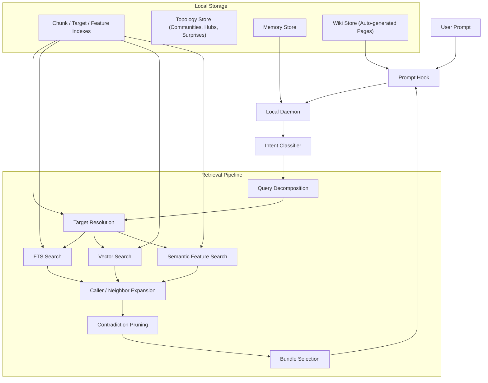
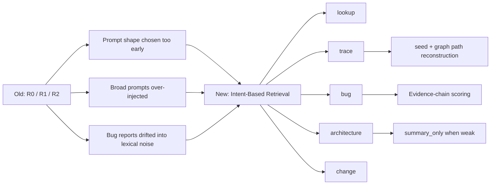

# Reporecall

```text
██████╗ ███████╗██████╗  ██████╗ ██████╗ ███████╗ ██████╗ █████╗ ██╗     ██╗
██╔══██╗██╔════╝██╔══██╗██╔═══██╗██╔══██╗██╔════╝██╔════╝██╔══██╗██║     ██║
██████╔╝█████╗  ██████╔╝██║   ██║██████╔╝█████╗  ██║     ███████║██║     ██║
██╔══██╗██╔══╝  ██╔═══╝ ██║   ██║██╔══██╗██╔══╝  ██║     ██╔══██║██║     ██║
██║  ██║███████╗██║     ╚██████╔╝██║  ██║███████╗╚██████╗██║  ██║███████╗███████╗
╚═╝  ╚═╝╚══════╝╚═╝      ╚═════╝ ╚═╝  ╚═╝╚══════╝ ╚═════╝╚═╝  ╚═╝╚══════╝╚══════╝
```

Local codebase memory, auto-generated wiki, and an interactive architecture dashboard — for Claude Code and MCP.

Reporecall indexes your repository locally, classifies each query by intent, and injects focused code context, **auto-generated wiki pages**, and persistent memory before Claude answers. Then it gives you a **self-contained HTML dashboard** to see the whole picture at a glance. No cloud, no embeddings API, everything stays on your machine.

---

## Quick Start

```bash
npm install -g @proofofwork-agency/reporecall

reporecall init          # Create .memory/, hooks, MCP config
reporecall index         # Index the codebase (builds topology + wiki)
reporecall serve         # Start daemon + file watcher
reporecall lens --serve  # Open the architecture dashboard
```

That's it. Context is injected automatically into every Claude Code prompt via hooks, wiki pages regenerate as the code changes, and the lens dashboard is always one command away.

---

## Headline Features

### Lens — interactive architecture dashboard

One command, one HTML file, your whole codebase at a glance:

```bash
reporecall lens --serve --open
```

A five-tab dark-themed dashboard built from your pre-computed index:

- **Overview** — project stats, a D3 chord diagram of inter-community call flows, top hubs, top surprises
- **Communities** — expandable Louvain cluster cards with member tables, cohesion scores, cross-community bar charts
- **Hubs** — the structural load-bearing walls of your codebase, each with caller/callee lists and wiki mentions
- **Surprises** — a sortable table of unexpected cross-boundary connections with reasons and investigation questions
- **Wiki** — a full browser for auto-generated wiki pages with interlinks, backlinks, and related symbols

Every tab includes an inline legend explaining how to read it. The HTML is fully self-contained (inline CSS, inline JSON data, D3 from CDN) — email it, host it on S3, drop it in a PR comment, or serve it locally with `--serve` for a clickable localhost URL.

### Wiki — a living, auto-generated knowledge base

Inspired by [Andrej Karpathy's LLM Wiki](https://www.mindstudio.ai/blog/andrej-karpathy-llm-wiki-knowledge-base-claude-code) concept — but built for you, from your code, automatically.

- **Zero authoring required.** Wiki pages are generated from topology: one page per community, one per hub, one per surprise cluster, plus flow traces.
- **Always fresh.** Pages regenerate on every index, on daemon startup, and on `reporecall lens`. A `sourceCommit` guard skips unchanged pages so regeneration is cheap.
- **Injected, not searched.** Relevant wiki pages are injected directly into Claude Code prompts within a configurable token budget — no manual `wiki_read` needed.
- **Linked and navigable.** Pages reference each other with `[[slug]]` interlinks; backlinks are tracked automatically. Browse them in the lens Wiki tab or via the `wiki_*` MCP tools.
- **Measured.** On a 1,140-file production codebase, wiki injection shows **100% precision** with 50% hit rate — when it fires, it's right.

### Intent-routed retrieval

Every prompt is classified locally into one of six modes — `lookup`, `trace`, `bug`, `architecture`, `change`, or `skip` — and routed to a tailored retrieval strategy. No LLM cost, no latency, no cloud calls.

---

## What else is in the box

- **Multi-signal search** — FTS keywords, vector similarity, AST metadata, semantic features, imports, call graphs
- **Topology analysis** — Louvain community detection, hub identification, surprise scoring, investigation suggestions
- **Bug localization** — dedicated pipeline with subject profiling, contradiction pruning, graph expansion
- **Persistent memory** — rules, facts, episodes, and working context across sessions
- **Delivery modes** — `code_context` (focused chunks) or `summary_only` (structured fallback when confidence is low)
- **Hook guidance** — context strength, execution surface, missing evidence, recommended next reads
- **Streaming indexer** — bounded file windows, adaptive embedding batches, lower peak heap
- **SQLite ABI self-repair** — detects native module mismatch and attempts automatic rebuild
- **MCP server** — 26 tools for code search, call graphs, topology, memory, and wiki

---

## How It Works

Every user prompt flows through a three-layer pipeline: code retrieval, wiki knowledge, and project memory.



### Intent classification

Queries are classified locally (no LLM) into one of six modes that determine retrieval strategy:

| Mode           | Purpose                                                               |
| -------------- | --------------------------------------------------------------------- |
| `lookup`       | Exact symbol, file, endpoint, or module lookup                        |
| `trace`        | Implementation path - "how does X work", "what calls Y"               |
| `bug`          | Causal debugging - symptom descriptions, "why does this fail"         |
| `architecture` | Broad inventory - "which files implement...", "full flow from A to B" |
| `change`       | Cross-cutting edits - "add logging across the auth flow"              |
| `skip`         | Meta/chat/non-code prompts                                            |



### Memory layer

Persistent project memory across sessions. Stores feedback rules, project decisions, user preferences, and reference pointers. Memory search uses FTS5 with RRF scoring, recency decay, access frequency penalties, and type-based boosts.

### `reporecall lens` flags

| Flag | Default | Description |
|------|---------|-------------|
| `--project <path>` | auto-detect | Project root path |
| `--open` | - | Open generated HTML in default browser (or the served URL when combined with `--serve`) |
| `--serve` | - | Serve the dashboard over HTTP on localhost |
| `--port <n>` | `7878` | Port for `--serve` |
| `--output <path>` | `.memory/lens.html` | Custom output path |
| `--json` | - | Output raw `DashboardData` JSON instead of HTML |
| `--max-communities <n>` | `20` | Max communities to include |
| `--max-hubs <n>` | `15` | Max hub nodes to include |
| `--max-surprises <n>` | `20` | Max surprises to include |

---

## CLI

```bash
reporecall init          # Create .memory/, hooks, MCP config
reporecall index         # Index the codebase
reporecall serve         # Start daemon + file watcher
reporecall lens          # Generate interactive architecture dashboard
reporecall explain       # Inspect retrieval for a query
reporecall mcp           # Run as MCP server (stdio)
reporecall doctor        # Health checks
reporecall search        # Direct search
reporecall stats         # Index statistics
reporecall graph         # Call graph queries
reporecall conventions   # Detected conventions
```

---

## MCP Tools

### Code search & navigation

| Tool | Description |
|------|-------------|
| `search_code` | Multi-signal code search across the indexed codebase |
| `find_callers` | Find all callers of a function |
| `find_callees` | Find all functions called by a function |
| `get_symbol` | Get full source of a symbol by name |
| `get_imports` | Get import/dependency graph for a file |
| `explain_flow` | Trace execution path: callers -> seed -> callees |
| `build_stack_tree` | Full call hierarchy tree (configurable depth) |
| `resolve_seed` | Resolve a query to the best matching symbol |

### Topology & architecture

| Tool | Description |
|------|-------------|
| `get_communities` | Module clusters with cohesion scores and auto-generated labels |
| `get_hub_nodes` | Most-connected nodes (architectural hubs) in the call graph |
| `get_surprises` | Unexpected cross-boundary connections ranked by surprise score |
| `suggest_investigations` | Auto-generated investigation questions about weak spots |

### Wiki

| Tool | Description |
|------|-------------|
| `wiki_query` | Search wiki pages by topic |
| `wiki_read` | Read a specific wiki page |
| `wiki_write` | Create or update a wiki page |
| `wiki_check_staleness` | Find wiki pages that may be outdated |

### Memory

| Tool | Description |
|------|-------------|
| `recall_memories` | Retrieve memories relevant to a query |
| `store_memory` | Save a new memory |
| `forget_memory` | Remove a memory |
| `list_memories` | List all stored memories |
| `explain_memory` | Explain why a memory was returned |
| `compact_memories` | Merge redundant memories |
| `clear_working_memory` | Clear ephemeral working memories |

### Index management

| Tool | Description |
|------|-------------|
| `index_codebase` | Trigger a full or incremental re-index |
| `get_stats` | Index statistics (files, symbols, chunks) |
| `clear_index` | Reset the index |

---

## Configuration

Configuration lives in `.memory/config.json` in your project root.

| Key | Default | Description |
|-----|---------|-------------|
| `wikiBudget` | `400` | Max tokens for wiki injection per prompt |
| `wikiMaxPages` | `3` | Max wiki pages injected per prompt |
| `memoryBudget` | `500` | Max tokens for memory injection per prompt |
| `shutdownTimeoutMs` | `10000` | Graceful shutdown timeout (1000-60000) |
| `embeddingProvider` | `"keyword"` | Embedding backend (`keyword` for FTS-only) |

---

## Showcase

Real output from a 1,140-file production codebase.

<details>
<summary><code>get_communities</code> - Module clusters with cohesion scores</summary>

```json
[
  {
    "id": "c_0",
    "nodeCount": 305,
    "cohesion": 0.01,
    "label": "api: json, getCorsHeaders"
  },
  {
    "id": "c_1",
    "nodeCount": 283,
    "cohesion": 0.01,
    "label": "components: updateNode, runFromNode"
  },
  {
    "id": "c_2",
    "nodeCount": 252,
    "cohesion": 0.01,
    "label": "components: observe, disconnect"
  },
  {
    "id": "c_3",
    "nodeCount": 227,
    "cohesion": 0.02,
    "label": "components+hooks: success, useAuth"
  },
  {
    "id": "c_4",
    "nodeCount": 220,
    "cohesion": 0.02,
    "label": "lib: isArray, updateNodeRun"
  },
  {
    "id": "c_5",
    "nodeCount": 153,
    "cohesion": 0.02,
    "label": "api: assertEquals, sanitizePrompt"
  },
  {
    "id": "c_6",
    "nodeCount": 132,
    "cohesion": 0.02,
    "label": "lib: warn, FloatingActionBar"
  },
  {
    "id": "c_7",
    "nodeCount": 121,
    "cohesion": 0.02,
    "label": "components: render, useTheme"
  }
]
```

Automatically detects tightly-coupled module clusters using Louvain community detection on the call graph.

</details>

<details>
<summary><code>get_hub_nodes</code> - Architectural hubs (most-connected functions)</summary>

```
 #  Name              File                                            Edges  Community
 1  json              api/gateway/index.ts                               135  api
 2  updateNode        lib/execution/workflow/WorkflowStore.ts            127  components
 3  isArray           lib/flow/typeGuards.ts                              94  lib
 4  success           lib/events/eventBus.ts                              70  hooks
 5  render            components/ErrorBoundary.tsx                        62  components
 6  asNumber          lib/editor/effects/registry.ts                      55  editor
 7  runFromNode       lib/execution/workflow/starter.ts                   52  components
 8  getCorsHeaders    api/_shared/cors.ts                                 50  api
 9  sanitizePrompt    api/_shared/prompt-sanitizer.ts                     46  api
10  processStep       lib/flow/graphBuilder/core/router.ts                44  graphBuilder
```

Identifies functions that would cause the most disruption if changed - the structural load-bearing walls of your codebase.

</details>

<details>
<summary><code>get_surprises</code> - Unexpected cross-boundary connections</summary>

```
Score  Source → Target                                           Why
  7    saveToLibrary → ExtensionCard                             weakly-resolved, crosses backend ↔ UI,
       (job-completion.ts → card.tsx)                            crosses execution surfaces

  6    transcribe → TranscriptionPanel                           weakly-resolved, crosses services ↔ components
       (transcription-service.ts → transcription-panel.tsx)

  6    useToast → Toaster                                        crosses hooks ↔ components,
       (use-toast.ts → toaster.tsx)                              peripheral node reaches hub

  6    getExecutionPathNodeIds → getDownstreamNodeIds            bridges communities 11 → 1,
       (useWorkflowCost.ts → graphTraversal.ts)                 crosses state ↔ shared execution surfaces

  6    compileSystemPrompt → memo_handler                        weakly-resolved, crosses lib ↔ components
       (promptTemplates.ts → PromptNode.tsx)
```

Surfaces connections that shouldn't exist or deserve closer inspection - potential coupling violations, false positives in the graph, or legitimate but non-obvious architectural bridges.

</details>

<details>
<summary><code>suggest_investigations</code> - Auto-generated investigation questions</summary>

```
Type              Question
weak_resolution   What is the exact relationship between RecoveryPollingQueue
                  and useRecovery? (alias_path across services ↔ hooks)

weak_resolution   What is the exact relationship between useTemplates and
                  EditorSidebar? (alias_path across hooks ↔ components)

bridge_node       Why does `cn` connect 8 structurally distant communities?
                  (High betweenness centrality)

bridge_node       Why does `updateNode` connect Inspector, ActionBar,
                  isArray, and useAuth? (Bridges distant modules)

verify_inferred   Are the 18 weakly-resolved relationships involving `error`
                  actually correct? (Hub node with alias-resolved edges)

isolated_nodes    What connects defineConfig_handler, SitemapEntry,
                  generateSitemapXml to the rest of the system?
                  (5 weakly-connected nodes - possible documentation gaps)
```

Tells you where to look next - no prompt engineering required.

</details>

<details>
<summary><code>explain_flow</code> - Trace execution across files</summary>

Query: `handleRetryAction`

```
Callers (who invokes this):
  ← handleBatchExecution           (batchProcessor.ts)
  ← triggerDownstreamNodes         (downstreamTrigger.ts)
  ← executeNode                    (nodeExecutor.ts)

Seed:
  ► handleRetryAction              (retryManager.ts:126-196)
    Extracts retry action, clears downstream execution state,
    resets node statuses, re-executes from target node

Callees (what this invokes):
  → getDownstreamNodeIds           (graphTraversal.ts:15-32)
  → addLog                         (workflowStore.ts:134-139)
```

Returns the full function source of the seed plus caller/callee code - one MCP call, 899 tokens, 6 files traced.

</details>

<details>
<summary><code>build_stack_tree</code> - Full call hierarchy</summary>

Query: `runWorkflow` (depth: 2, direction: both)

```
                 StartNode.tsx (memo_handler)
                 InpaintNode.tsx (useCallback_handler)
                 ActionBar.tsx
                        │
                        ▼
              ► runWorkflow (starter.ts)
                        │
            ┌───────────┼───────────┐
            ▼           ▼           ▼
     ensureFlowSaved  addLog   workflowStarted
     (ensureFlowSaved.ts) (workflowStore.ts) (activityLogger.ts)
            │                       │
       ┌────┴────┐                  ▼
       ▼         ▼              info (logger.ts)
 serializeFlow  saveToDatabase
 (serialization.ts) (dataService.ts)
```

10 nodes, 9 edges, 2 levels deep. Pure static analysis - zero LLM cost.

</details>

---

## Changelog

### v0.6.2 - Lens Architecture Dashboard

This release adds `reporecall lens`, an interactive architecture dashboard that visualizes your codebase structure as a self-contained HTML file, and promotes the wiki layer into a first-class selling point alongside it.

**Lens dashboard.** Five-tab HTML dashboard generated from existing index data: Overview (stats + D3 chord diagram), Communities (expandable Louvain cluster cards), Hubs (caller/callee cards), Surprises (sortable table + investigation questions), Wiki (browsable auto-generated pages). Every tab includes a legend explaining what the data means. No external server needed — one HTML file with inline CSS, JS, and D3.js.

**Lens `--serve` mode.** New `--serve` / `--port <n>` flags spin up a minimal local HTTP server (default `http://localhost:7878`) so you can open the dashboard as a URL rather than a `file://` path. Combines with `--open` to launch it straight into your browser. Cross-platform (macOS/Linux/Windows), graceful Ctrl+C shutdown, no caching so reruns show fresh data.

**Wiki generation on lens.** `reporecall lens` auto-generates wiki pages from topology before building the dashboard, so wiki content is always fresh without needing `reporecall index`.

**Community membership fix.** Fixed a bug where wiki community pages were never generated because `getCommunityForChunk` was called with symbol names instead of chunk IDs.

**Reranker removal.** Removed the local cross-encoder reranker. The retrieval pipeline now uses hydration only. The `rerank` config option is deprecated and ignored.

**Search intent expansion.** New regex patterns improve query routing for workflow lifecycle, bot systems, billing/generation cross-domain, and job orchestration queries.

**Concept family expansion.** New "workflow" and "bot" concept families. Expanded "billing" (credits) and "queue" (poll, status) families.

**Hybrid search tuning.** Broader trace-aware prepend for bot/webhook/queue/workflow queries. New seed scoring penalty for generic resolved file targets.

<details>
<summary>v0.6.1 - Wiki Startup Generation & Version Sync</summary>

**Wiki startup generation.** Wiki pages now auto-generate on MCP server and daemon startup, not just during `index_codebase`. Ensures wiki context is always available without requiring a full re-index.

**Wiki generator freshness guard.** `writePage` now checks `sourceCommit` from disk to skip unchanged pages. Fixed `surprisesPage` flag not being set on the generation result.

**Version sync.** `package-lock.json` synced to match `package.json`.

</details>

<details>
<summary>v0.6.0 - Wiki Layer & Memory Precision</summary>

This release adds an **always-on wiki layer** for persistent codebase knowledge and fixes three memory retrieval bugs that caused noisy or missing context injection.

**Wiki layer.** Auto-generated wiki pages from codebase topology are indexed alongside code and injected into every prompt context within a configurable token budget.

**5 new MCP tools** for wiki management: `wiki_query`, `wiki_read`, `wiki_write`, `wiki_check_staleness`.

**FTS5 phrase query fix.** Stop words ("how", "does", "work") were included in phrase queries, causing FTS5 to match only exact phrases and short-circuit before AND/OR fallback. Queries like "how does image generation work" now correctly find wiki pages matching "image generation".

**Memory type isolation.** Wiki pages (type `wiki`) no longer leak into memory search results. The memory search pipeline now explicitly filters to `user`, `feedback`, `project`, and `reference` types.

**Access count penalty.** Over-accessed memories are now penalized: >15 accesses -> 0.5x score, >8 accesses -> 0.75x. Prevents generic feedback rules from drowning out topic-specific results.

**Tighter relevance threshold.** Raised from 0.70 to 0.85, filtering out low-relevance tail results.

Benchmark results (1,140-file production codebase, 30 queries):

| Layer  | Precision | Hit Rate | Notes                                  |
| ------ | --------- | -------- | -------------------------------------- |
| Code   | 57%       | 100%     | Always injected                        |
| Wiki   | 100%      | 50%      | Only injects when relevant pages exist |
| Memory | 73%       | ~60%     | After access penalty + threshold fix   |

</details>

<details>
<summary>v0.5.0 - Topology-Aware Search & Architecture Decomposition</summary>

Added **codebase topology analysis** and decomposed the search engine into focused strategy modules.

**Topology analysis pipeline.** After each index, reporecall runs Louvain community detection on the call graph, identifies architectural hub nodes, scores surprising cross-boundary connections, and generates investigation questions. Results are persisted in SQLite and injected into prompt context automatically.

**4 new MCP tools** for exploring codebase structure: `get_communities`, `get_hub_nodes`, `get_surprises`, `suggest_investigations`.

**Community-aware search scoring.** Results from the same Louvain community as the query seed receive a locality boost, improving architecture and trace queries.

**Daemon hardening.** Index scheduler queues are bounded at 50k entries. File watcher has backpressure at 10k pending events. Shutdown timeout is now configurable via `shutdownTimeoutMs`.

**Hook request validation.** All hook endpoints now validate request bodies with Zod schemas, returning 400 with details on malformed payloads instead of silently misbehaving.

**Search architecture decomposition.** The monolithic `hybrid.ts` (~6,800 lines) was split into 7 focused modules: `pipeline-core`, `bug-strategy`, `architecture-strategy`, `trace-strategy`, `lookup-strategy`, `context-prioritization`, and the thin `hybrid` orchestrator. No public API changes.

Other improvements:
- Tree-sitter parse timeout (5s) prevents hangs on malformed files
- `reporecall mcp` warns when a daemon is already running (SQLite lock contention risk)
- Ollama health check added to the `mcp` command
- Bug intent classifier now recognizes plural forms ("bugs", "issues", "problems")
- New dependencies: `graphology`, `graphology-communities-louvain` for graph analysis

</details>

<details>
<summary>v0.4.1 - Claude Hook Compatibility Fix</summary>

This patch fixes Claude hook token lookup for real `claude -p` / headless sessions. Reporecall-generated hooks now fall back to `$PWD` when `$CLAUDE_PROJECT_DIR` is unavailable, so injected context reaches Claude reliably in local CLI sessions after re-running `reporecall init`.

</details>

<details>
<summary>v0.4.0 - Intent-Based Retrieval Overhaul</summary>

This release replaces the old `R0 / R1 / R2` routing model with intent-based query modes. The old model described retrieval shape (exact, trace, broad), the new model describes what the user actually wants:

| Mode           | Purpose                                                               |
| -------------- | --------------------------------------------------------------------- |
| `lookup`       | Exact symbol, file, endpoint, or module lookup                        |
| `trace`        | Implementation path - "how does X work", "what calls Y"               |
| `bug`          | Causal debugging - symptom descriptions, "why does this fail"         |
| `architecture` | Broad inventory - "which files implement...", "full flow from A to B" |
| `change`       | Cross-cutting edits - "add logging across the auth flow"              |
| `skip`         | Meta/chat/non-code prompts                                            |

Other changes in this release: streaming windowed indexing, adaptive embedding batches, semantic feature extraction, `summary_only` delivery for low-confidence bundles, PreToolUse hook guidance, and SQLite ABI self-repair.

</details>

---

## Development

```bash
npm install
npm run build
npm test
```

---

## Acknowledgments

The wiki layer is inspired by [Andrej Karpathy's LLM Wiki](https://www.mindstudio.ai/blog/andrej-karpathy-llm-wiki-knowledge-base-claude-code) concept - organizing codebase knowledge as structured markdown files that LLMs can query efficiently.

## License

MIT
