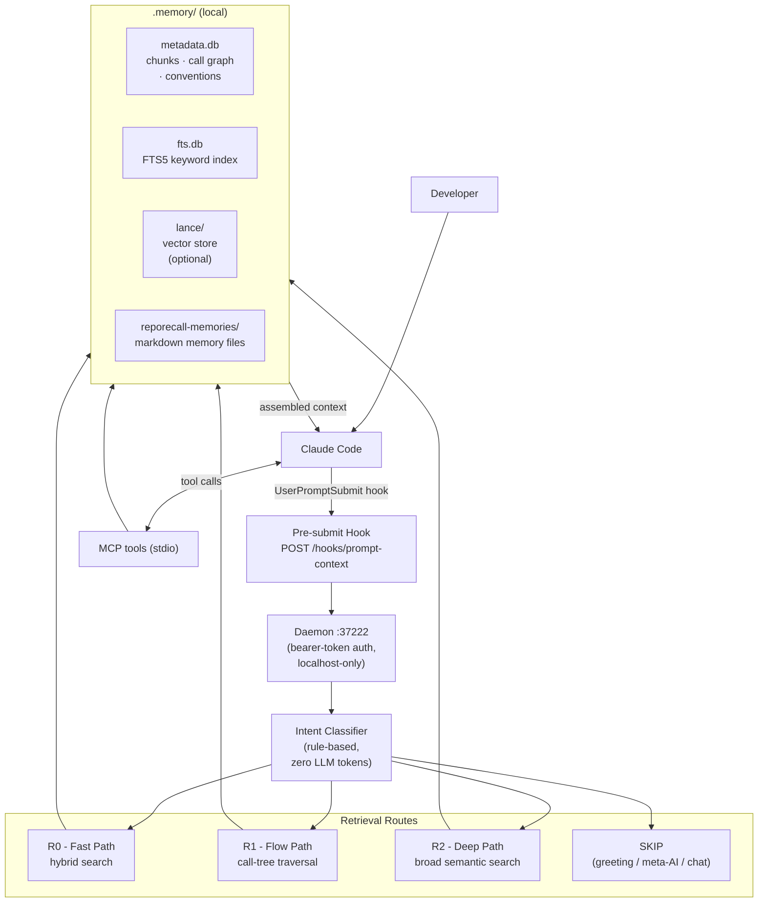

```
██████╗ ███████╗██████╗  ██████╗ ██████╗ ███████╗ ██████╗ █████╗ ██╗     ██╗
██╔══██╗██╔════╝██╔══██╗██╔═══██╗██╔══██╗██╔════╝██╔════╝██╔══██╗██║     ██║
██████╔╝█████╗  ██████╔╝██║   ██║██████╔╝█████╗  ██║     ███████║██║     ██║
██╔══██╗██╔══╝  ██╔═══╝ ██║   ██║██╔══██╗██╔══╝  ██║     ██╔══██║██║     ██║
██║  ██║███████╗██║     ╚██████╔╝██║  ██║███████╗╚██████╗██║  ██║███████╗███████╗
╚═╝  ╚═╝╚══════╝╚═╝      ╚═════╝ ╚═╝  ╚═╝╚══════╝ ╚═════╝╚═╝  ╚═╝╚══════╝╚══════╝
                              proofofwork
```

**Local codebase memory and project knowledge for Claude Code**

Reporecall indexes your codebase locally - AST chunks, call graph, keyword + vector search - and injects the right context before Claude processes your prompt. Starting with v0.3.0, it also maintains persistent cross-session memory for project decisions, coding conventions, and working state. It runs as a Claude Code hook and MCP server, entirely on your machine - no cloud storage or external API calls.

## The Problem

You ask Claude: _"how does the credit refund work when a job fails?"_

Claude doesn't know your codebase. So it starts searching:

```
Grep "refundCredits"       → found credit-utils.ts
Read credit-utils.ts       → ok, but who calls this?
Grep "refundCredits"       → found job-completion.ts
Read job-completion.ts     → found processJobCompletion, but what about failures?
Grep "processJobFailure"   → found another file
Read that file too         → finally has the picture
```

6 tool calls. 4 round-trips. ~15,000 tokens. And it still missed the error handler sites.

The same happens across sessions. Claude has no memory of the architectural decision you explained yesterday, the naming convention you corrected last week, or the half-finished refactor you left mid-flight. Every session starts from zero.

## With Reporecall

Same question. Reporecall's hook fires before the prompt reaches Claude:

```
→ Search index: "credit refund job fails"         (5ms, keyword + vector)
→ Top hit: refundCredits()
→ Call graph expansion: who calls refundCredits?
  ├─ processJobCompletion()   (job-completion.ts)
  └─ processJobFailure()     (job-completion.ts)
→ Inject context into prompt                       (~2K tokens)
```

0 tool calls. 1 round-trip. Claude already has the full picture - the function, its callers, and the failure path - before it writes a single word.

```
┌────────────────────┬──────────────────────┬─────────────────┐
│                    │ Without Reporecall   │ With Reporecall │
├────────────────────┼──────────────────────┼─────────────────┤
│ Tool calls         │ 6                    │ 0               │
│ Round-trips        │ 4                    │ 1               │
│ Tokens consumed    │ ~15,000              │ ~2,000          │
│ Latency            │ seconds              │ ~5ms            │
│ Found the callers  │ after 3 extra greps  │ automatically   │
│ Found error sites  │ no                   │ yes (10 files)  │
└────────────────────┴──────────────────────┴─────────────────┘
```

## Quick Start

```bash
npm install -g @proofofwork-agency/reporecall
reporecall init          # creates .memory/, hooks, MCP config
reporecall index         # indexes your codebase
reporecall serve         # starts daemon with file watcher
```

Then ask Claude questions normally. The hook injects relevant code and memory context before Claude answers.

### Daily Workflow

```bash
reporecall serve            # start once, runs all day with file watching
```

Then use Claude normally:

```
"How does the credit refund work when a job fails?"
  → Code context injected: refundCredits(), its callers, error handlers

"What did we decide about the auth token format?"
  → Memory recalled: stored rule about JWT structure from last week

"Walk me through the payment flow"
  → R1 flow tree: payment entry point → validation → charge → receipt

"Who calls validateUserInput?"
  → Call graph expansion shows all caller sites with surrounding code
```

## What's New in v0.3.0

- **Memory V1.** Persistent cross-session memory stores project knowledge, coding conventions, user preferences, and working state as markdown files in `.memory/reporecall-memories/`. Four memory classes (`rule`, `fact`, `episode`, `working`) with independent token budgets. Seven new MCP tools for memory management.
- **Broad workflow search.** New `selectBroadWorkflowBundle` handles architecture and inventory queries with corpus-aware term expansion and import corroboration. R2 NDCG@10 improved from 0.058 to 0.351.
- **Target resolution catalog.** New `TargetStore` indexes symbols, file modules, endpoints, and routes with alias-based lookup. Literal-dispatch resolution: `invoke("generate-image")` resolves to the handler file.
- **Query-path performance.** Seed resolution cache eliminates 2-3 redundant `resolveSeeds()` calls per search (~8-15ms saved). Query embedding LRU cache (50 entries) saves 15-40ms per hit. Route accuracy improved from 81.5% to 87%.
- **Robustness fixes.** `sanitizeQuery` strips `<system-reminder>`, `<tool-result>`, and `antml:*` XML blocks. Short conversational directives correctly classified as skip. Tree-sitter parse errors fall back to whole-file chunks.

## Features

### Code Search & Context Injection

- **AST chunking** - Tree-sitter parses 22 languages into functions, classes, methods, interfaces, and exports. Files with no extractable nodes fall back to file-level chunks.
- **Hybrid search** - FTS5 keyword search (Porter stemming, camelCase splitting) fused with cosine-similarity vector search via Reciprocal Rank Fusion.
- **Call graph expansion** - Top search hits are expanded through a static call graph to surface callers and callees automatically, without extra round-trips.
- **Intent classification** - Rule-based classifier (zero LLM tokens, <1ms) routes queries to R0 (fast), R1 (flow), R2 (broad), or SKIP.
- **Token-budgeted assembly** - Results are assembled into markdown code blocks under an auto-scaled token budget, with length penalty, test file demotion, and score floor filtering.

### Memory V1

Persistent cross-session memory layer for project knowledge, user preferences, and working state.

**Four memory classes:**

| Class     | Purpose                                         | Lifecycle                                       |
| --------- | ----------------------------------------------- | ----------------------------------------------- |
| `rule`    | Behavioral directives that override defaults    | Highest injection priority, survives compaction |
| `fact`    | Stable project knowledge and reference material | Survives compaction indefinitely                |
| `episode` | Session-specific observations and decisions     | Archived after 30 days by compaction            |
| `working` | Transient context generated during a session    | Cleared between sessions or on explicit reset   |

Each class has an independent token budget, so rules are never crowded out by verbose episodes. Memories are stored as markdown files with YAML frontmatter in `.memory/reporecall-memories/`, indexed by FTS, and injected alongside code context on every hook query.

**Compaction** deduplicates by content fingerprint, archives stale episodes, and promotes recurring patterns from episode to fact. Pinned memories survive compaction unconditionally.

**7 MCP tools:** `recall_memories`, `store_memory`, `forget_memory`, `list_memories`, `explain_memory`, `compact_memories`, `clear_working_memory`.

### MCP Integration (18 tools)

Reporecall exposes 18 MCP tools over stdio - 11 for code search and analysis, 7 for memory. The MCP server integrates with Claude Code through the auto-generated `.mcp.json` configuration.

**Code Search & Analysis:**

| Tool               | Description                                                 |
| ------------------ | ----------------------------------------------------------- |
| `search_code`      | Search the codebase using hybrid vector + keyword search    |
| `find_callers`     | Find functions that call a given function                   |
| `find_callees`     | Find functions called by a given function                   |
| `resolve_seed`     | Resolve a query to seed candidates for stack tree building  |
| `build_stack_tree` | Build a bidirectional call tree from a seed function/method |
| `get_imports`      | Get import statements for a file                            |
| `get_symbol`       | Look up code symbols by name                                |
| `explain_flow`     | Explain the call flow around a query or function name       |
| `index_codebase`   | Index or re-index the codebase                              |
| `get_stats`        | Get index statistics, conventions, and latency info         |
| `clear_index`      | Clear all indexed data                                      |

**Memory:**

| Tool                   | Description                                                    |
| ---------------------- | -------------------------------------------------------------- |
| `recall_memories`      | Search project and user memories using local keyword retrieval |
| `explain_memory`       | Explain how memory recall would behave for a query             |
| `compact_memories`     | Refresh and compact memory indexes                             |
| `clear_working_memory` | Clear generated working memory entries                         |
| `store_memory`         | Create or update a memory file                                 |
| `forget_memory`        | Delete a memory by name                                        |
| `list_memories`        | List all stored memories with metadata                         |

### Search Modes

- **R0 - Fast Path**: Hybrid keyword + vector search for direct lookups. Best for specific symbols or exact terms. Typical latency ~10ms.
- **R1 - Flow Path**: Bidirectional call-tree traversal from a seed symbol. Shows callers and callees up to 2 levels deep. Best for "how does X work" and debugging questions.
- **R2 - Deep Path**: Broad semantic search with corpus-aware term expansion and import corroboration. Best for architecture, inventory, and cross-cutting queries.

## How It Works

1. You ask Claude a question. The `UserPromptSubmit` hook fires before Claude sees the prompt.
2. The hook POSTs the query to the local daemon (localhost:37222, bearer-token auth).
3. The query is sanitized (XML tags, code blocks, temp paths stripped).
4. The intent classifier routes the query: **SKIP** (greeting/meta), **R0** (direct lookup), **R1** (flow/call-tree), or **R2** (broad architecture).
5. Seed symbols are extracted from the query (PascalCase/camelCase tokens matched against the index).
6. Hybrid search runs: FTS5 keyword search + vector cosine search, fused via Reciprocal Rank Fusion.
7. Call graph expansion adds callers and callees of top hits (R1 builds a full bidirectional tree).
8. Memory recall searches `.memory/reporecall-memories/` for relevant rules, facts, and episodes.
9. Context assembly combines code chunks and memory under a token budget, prioritizing implementation over tests.
10. The assembled context is injected into the prompt. Claude answers with full codebase and memory context.

## Architecture



## What It Solves / What It Doesn't

**Solves:**

- **Grep chains.** Claude doing 4-6 Grep/Read round-trips to understand code before answering. Reporecall eliminates this for code understanding questions - the context is already there.
- **Token cost and API spend.** Lower prompt usage on repeated repo work. The exact reduction depends on the repo and query mix.
- **Depth.** Grepping finds the function you asked about. It doesn't tell you who calls it, or what it calls. The call graph surfaces that automatically.
- **Round-trip latency.** One hook injection (~5ms) replaces multiple sequential tool calls (seconds).
- **Session amnesia.** Decisions, conventions, and working state persist across restarts as structured memories.

**Doesn't solve:**

- **Claude's context window.** Reporecall injects into the same window. Long conversations still hit the limit.
- **Non-code tasks.** File edits, running tests, debugging runtime behavior - Claude still uses tools for those.
- **Vague queries.** If there's no symbol or keyword to anchor on ("make this faster"), retrieval is weak.
- **Type-resolved accuracy.** The call graph is name-based, not type-resolved. Two unrelated functions with the same name can produce false edges.

## Supported Languages

22 languages: TypeScript, TSX, JavaScript, Python, Go, Rust, Java, Ruby, C, C++, C#, PHP, Swift, Kotlin, Scala, Zig, Bash, Lua, HTML, Vue, CSS, TOML

The scanner also indexes fallback file types by default: `.json`, `.md`, `.sql`, `.svelte` (as file-level chunks).

## Commands

| Command                      | Description                                                                |
| ---------------------------- | -------------------------------------------------------------------------- |
| `reporecall init`            | Initialize Reporecall in a project (creates `.memory/`, hooks, MCP config) |
| `reporecall index`           | Index or re-index the codebase                                             |
| `reporecall search <query>`  | Search the index directly                                                  |
| `reporecall serve`           | Start daemon, watcher, and HTTP hook server                                |
| `reporecall stats`           | Display index and latency statistics                                       |
| `reporecall graph <name>`    | Show callers/callees for a symbol                                          |
| `reporecall conventions`     | Show detected coding conventions                                           |
| `reporecall explain <query>` | Show route decision, seed, and retrieved context                           |
| `reporecall mcp`             | Start MCP server on stdio                                                  |
| `reporecall doctor`          | Diagnose common setup problems                                             |

Key options: `--project <path>`, `--debug`, `--port <n>`, `--mcp`, `--embedding-provider local|ollama|openai|keyword`, `--autostart` (macOS launch agent).

## Configuration

Config lives in `.memory/config.json`. All fields are optional.

### Core Settings

| Field                 | Type   | Default                     | Description                               |
| --------------------- | ------ | --------------------------- | ----------------------------------------- |
| `projectRoot`         | string | (auto)                      | Root directory of the project             |
| `dataDir`             | string | `.memory`                   | Directory for indexes and data            |
| `port`                | number | 37222                       | HTTP port for daemon                      |
| `debounceMs`          | number | 2000                        | Debounce delay for file watcher           |
| `embeddingProvider`   | string | `"local"`                   | `local`, `ollama`, `openai`, or `keyword` |
| `embeddingModel`      | string | `"Xenova/all-MiniLM-L6-v2"` | Model for local/Ollama embeddings         |
| `embeddingDimensions` | number | 384                         | Dimension of embedding vectors            |
| `ollamaUrl`           | string | `"http://localhost:11434"`  | URL for Ollama service (localhost only)   |

### Search & Retrieval

| Field                   | Type    | Default                           | Description                              |
| ----------------------- | ------- | --------------------------------- | ---------------------------------------- |
| `contextBudget`         | number  | 0 (auto)                          | Token budget for context (`0` = dynamic) |
| `maxContextChunks`      | number  | 0 (auto)                          | Max chunks in context (`0` = auto)       |
| `sessionBudget`         | number  | 2000                              | Token budget per session                 |
| `searchWeights.vector`  | number  | 0.5                               | Weight for vector similarity             |
| `searchWeights.keyword` | number  | 0.3                               | Weight for keyword matching              |
| `searchWeights.recency` | number  | 0.2                               | Weight for recency boost                 |
| `rrfK`                  | number  | 60                                | Reciprocal Rank Fusion parameter         |
| `graphExpansion`        | boolean | true                              | Enable call graph expansion              |
| `graphDiscountFactor`   | number  | 0.6                               | Score discount for expanded nodes        |
| `siblingExpansion`      | boolean | true                              | Include sibling functions                |
| `siblingDiscountFactor` | number  | 0.4                               | Score discount for siblings              |
| `reranking`             | boolean | false                             | Enable cross-encoder reranking           |
| `rerankingModel`        | string  | `"Xenova/ms-marco-MiniLM-L-6-v2"` | Reranking model                          |
| `rerankTopK`            | number  | 25                                | Rerank top K results                     |

### Scoring & File Scanning

| Field                    | Type     | Default                  | Description                         |
| ------------------------ | -------- | ------------------------ | ----------------------------------- |
| `batchSize`              | number   | 32                       | Chunk batch size for embedding      |
| `maxFileSize`            | number   | 102400                   | Skip files larger than 100KB        |
| `extensions`             | string[] | 22+ types                | File extensions to index            |
| `ignorePatterns`         | string[] | node_modules, .git, etc. | Patterns to exclude from indexing   |
| `implementationPaths`    | string[] | src/, lib/, bin/         | Paths prioritized for code analysis |
| `codeBoostFactor`        | number   | 1.5                      | Boost factor for code chunks        |
| `testPenaltyFactor`      | number   | 0.3                      | Penalty for test files              |
| `anonymousPenaltyFactor` | number   | 0.5                      | Penalty for anonymous functions     |

### Memory

| Field                          | Type     | Default                         | Description                           |
| ------------------------------ | -------- | ------------------------------- | ------------------------------------- |
| `memory`                       | boolean  | true                            | Enable memory layer                   |
| `memoryBudget`                 | number   | 500                             | Token budget for memory context       |
| `memoryDirs`                   | string[] | []                              | Additional memory directories to scan |
| `memoryWatch`                  | boolean  | true                            | Watch memory dirs while daemon runs   |
| `memoryCodeFloorRatio`         | number   | 0.8                             | Minimum code context ratio            |
| `memoryHotBudget`              | number   | 120                             | Budget for rule memories              |
| `memoryWorkingBudget`          | number   | 80                              | Budget for working memory             |
| `memoryEpisodeBudget`          | number   | 150                             | Budget for episode summaries          |
| `memoryArchiveDays`            | number   | 30                              | Archive episodes older than N days    |
| `memoryCompactionHours`        | number   | 6                               | Compact indexes every N hours         |
| `memoryWritableDir`            | string   | `".memory/reporecall-memories"` | Writable memory directory             |
| `memoryAutoCreate`             | boolean  | true                            | Auto-generate working memory          |
| `memoryFactPromotionThreshold` | number   | 3                               | Retrievals before promoting to fact   |
| `memoryWorkingHistoryLimit`    | number   | 1                               | Working memory snapshots to retain    |

### Hooks

| Hook                    | Type               | Purpose                                                                               |
| ----------------------- | ------------------ | ------------------------------------------------------------------------------------- |
| `/hooks/session-start`  | `SessionStart`     | Injects codebase conventions and memory-engine instructions at session start          |
| `/hooks/prompt-context` | `UserPromptSubmit` | Sanitizes query, classifies intent, routes to R0/R1/R2, injects code + memory context |

Additional daemon endpoints: `GET /health`, `GET /ready`, `GET /status`, `GET /metrics`.

## Team Collaboration

Reporecall uses a **three-tier configuration pattern** for teams:

| Tier               | Location                             | Committed | Purpose                             |
| ------------------ | ------------------------------------ | --------- | ----------------------------------- |
| **Global**         | `~/.claude/settings.json`            | No        | Personal preferences (model, theme) |
| **Project Shared** | `.claude/settings.json`, `.mcp.json` | Yes       | Team-wide hooks, MCP config         |
| **Local**          | `.claude/settings.local.json`        | No        | Custom port, proxy, tokens          |

```bash
git clone <repo> && cd <repo>
reporecall init    # generates .claude/settings.json + .mcp.json
reporecall index   # build the local index
```

Hooks use `$CLAUDE_PROJECT_DIR` so they resolve correctly on any machine. Claude Code automatically merges local settings over shared settings. Each teammate runs `reporecall init` once after cloning.

## Privacy & Data

Reporecall runs **entirely on your machine**:

- No external API calls during retrieval
- No telemetry or data collection
- No cloud dependency or uploads
- All code index data stays local in `.memory/` (metadata.db, fts.db, lance/, merkle.json)
- All memory files stay local in `.memory/reporecall-memories/` as plain markdown - readable, editable, deletable without tooling
- Works offline after initial setup

## Benchmark

Live benchmark on the Reporecall codebase (54 queries, keyword mode, full production pipeline):

| Metric      | Overall | exact_lookup | flow  | architecture | debugging |
| ----------- | ------- | ------------ | ----- | ------------ | --------- |
| **NDCG@10** | 0.455   | 0.552        | 0.484 | 0.308        | 0.350     |
| **MRR**     | 0.637   | 0.643        | 0.731 | 0.440        | 0.588     |
| **Queries** | 54      | 14           | 18    | 7            | 8         |

| Metric         | Value  |
| -------------- | ------ |
| Route accuracy | 87%    |
| Median latency | 10.4ms |
| Avg latency    | 13.3ms |
| P95 latency    | 36.7ms |

7 meta queries (greetings, "what model are you", etc.) correctly routed to SKIP with zero retrieval.

Methodology: each query runs through the full production pipeline (`handlePromptContextDetailed` with seed boosting, concept bundles, graph expansion, and hook priority scoring). Results scored against human-graded relevance annotations (0-3 scale, CodeSearchNet/TREC conventions).

```bash
npm run benchmark                              # keyword mode (~1s)
npm run benchmark -- --provider semantic       # with vector embeddings
```

## Security & Operational Notes

- **Local-only**: daemon binds to `127.0.0.1`, all data stays in `.memory/`, no telemetry, works offline.
- **Auth**: bearer-token authentication on all non-health routes with timing-safe comparison. Rate limiting per client IP.
- **Input safety**: parameterized SQL, path traversal prevention, symlink escape detection, ReDoS-safe regex validation, `ollamaUrl` restricted to localhost.
- **`.memoryignore`**: exclude generated code, fixtures, or sensitive files from indexing (stacks with `.gitignore`).
- **Daemon lifecycle**: PID file locking, stale PID detection, graceful 10-step shutdown on SIGTERM/SIGINT, force-exit timeout.
- **File permissions**: token file and PID file created with restrictive permissions.

## Best Practices

**Keep the index warm.** Run `reporecall serve` during development so the watcher keeps the index current. Use `reporecall index` for CI or one-shot refreshes.

**Scope the repo deliberately.** Use `.memoryignore` to exclude generated code, vendored code, or large irrelevant files.

**Prefer natural-language queries.** Hybrid search works better on descriptive queries than short tokens.

**Use `keyword` mode for zero embedding dependencies.** `embeddingProvider: "keyword"` skips vectors entirely.

**Use `--debug` when validating hook behavior.** Logs hook requests, sanitized queries, retrieval counts, and context assembly details.

**Compact memories periodically.** Run `reporecall memory compact` (or the `compact_memories` MCP tool) every few weeks to deduplicate, archive stale episodes, and promote high-confidence facts.

**Review what's been stored.** Run `reporecall memory list` to audit accumulated memories. Memories are plain markdown in `.memory/reporecall-memories/` - edit or delete them directly.

**Pin critical memories.** Set `pinned: true` in a memory's frontmatter to prevent it from being archived during compaction.

## Cost & License

- **Open source**: MIT license
- **No ongoing costs**: One-time npm install
- **No subscription**: Use indefinitely
- **No API fees**: All processing local

## Development

```bash
git clone https://github.com/nicholasgriffintn/reporecall.git
cd reporecall
npm install
npm run build
npm test                    # 618 tests across 45 files
npm run benchmark           # keyword mode (~1s)
npm run smoke               # end-to-end CLI + MCP tool verification
```

### Smoke Test

`npm run smoke` runs an end-to-end test of all CLI commands and MCP tools against the current project's `.memory/` index. Requires `npm run build` and an existing index.

### Updating Annotations

```bash
npx tsx benchmark/annotate.ts --project .       # generates benchmark/annotations-draft.json
# manually grade results 0-3, save as benchmark/annotations.json
```
