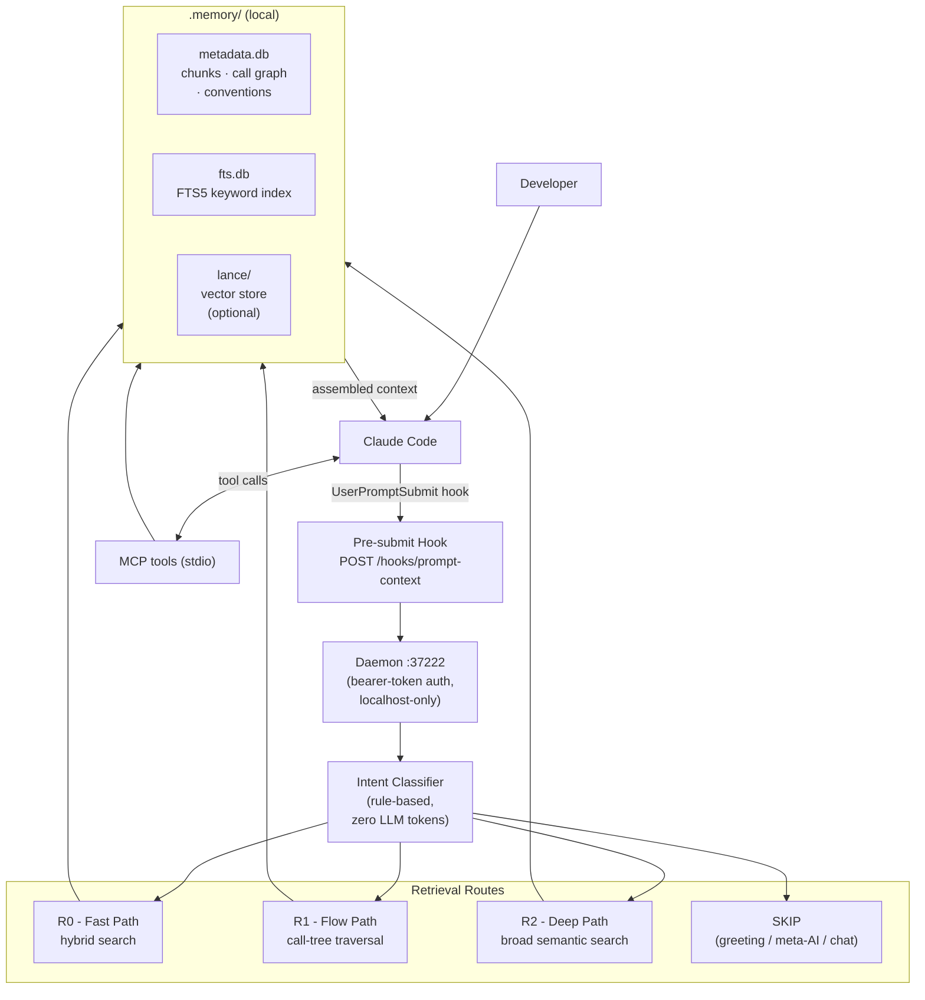
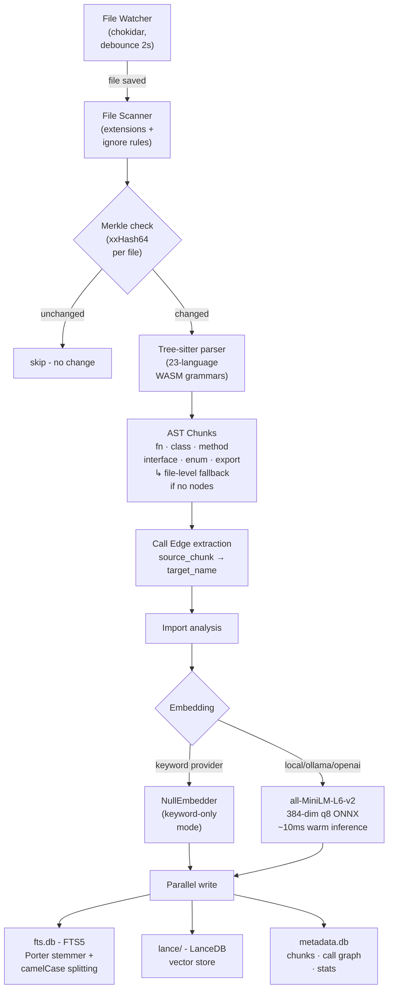
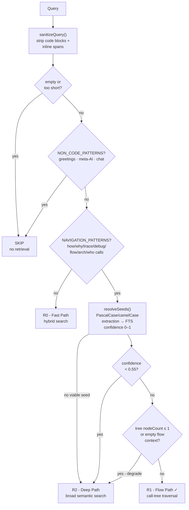
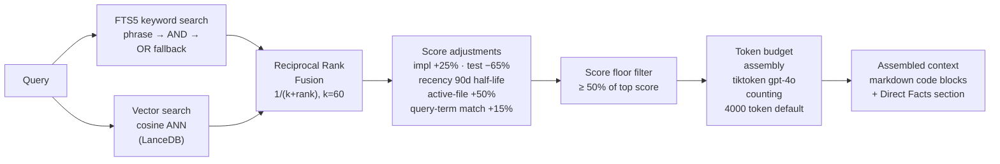
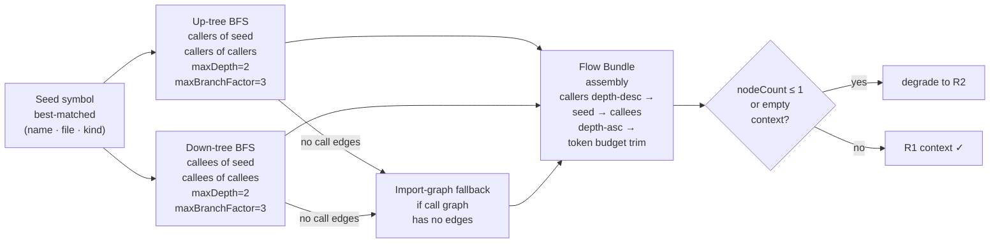

```
██████╗ ███████╗██████╗  ██████╗ ██████╗ ███████╗ ██████╗ █████╗ ██╗     ██╗
██╔══██╗██╔════╝██╔══██╗██╔═══██╗██╔══██╗██╔════╝██╔════╝██╔══██╗██║     ██║
██████╔╝█████╗  ██████╔╝██║   ██║██████╔╝█████╗  ██║     ███████║██║     ██║
██╔══██╗██╔══╝  ██╔═══╝ ██║   ██║██╔══██╗██╔══╝  ██║     ██╔══██║██║     ██║
██║  ██║███████╗██║     ╚██████╔╝██║  ██║███████╗╚██████╗██║  ██║███████╗███████╗
╚═╝  ╚═╝╚══════╝╚═╝      ╚═════╝ ╚═╝  ╚═╝╚══════╝ ╚═════╝╚═╝  ╚═╝╚══════╝╚══════╝
                              proofofwork
```

**Local codebase memory for Claude Code and MCP clients**

## Why Reporecall Exists

Reporecall solves a fundamental problem: when you ask Claude (or any AI) questions about your code, the AI doesn't have access to your codebase context. This means:

- Claude must ask you to share code snippets to answer questions
- Claude can't look up how your code is organized or how functions relate
- You can't benefit from Claude's intelligence for code navigation, understanding, or debugging
- New team members can't ask Claude to help them understand your project structure

Reporecall bridges this gap by building a **local search index** of your entire codebase that Claude can query. Everything stays on your machine.

## What It Does

Reporecall indexes a repository into code chunks, stores metadata and search indexes locally, and injects relevant context into Claude conversations through hooks. It can also expose the same index through MCP tools. It provides:

- **Hybrid retrieval**: Vector search (when embeddings enabled) + SQLite FTS5 keyword search for finding code by meaning and by exact terms
- **AST-based chunking**: Tree-sitter parses code into logical units (functions, classes, methods, interfaces, exports)
- **Call graph extraction**: Tracks which functions call which other functions for relationship queries
- **Import analysis**: Understands how files depend on each other
- **Conventions detection**: Identifies coding patterns and naming conventions in your project
- **Claude Code hook integration**: Automatically injects relevant code context when you ask questions
- **MCP server integration**: Exposes the index through Model Context Protocol for use in Claude or other AI clients
- **Incremental indexing**: Only re-indexes changed files, using Merkle-based change detection for efficiency

## How This Helps

| Capability | Enables |
|-----------|---------|
| **Local storage** | No cloud dependency; all code stays on your machine; works offline |
| **AST-based understanding** | Claude can find and discuss code by function/class/type, not just keywords |
| **Call graph queries** | "Show me all callers of X" or "what does X call?" — instant answers |
| **Import relationships** | Understanding dependencies and module organization |
| **Pattern detection** | Claude can identify and follow your team's coding conventions |
| **Context injection** | Claude has relevant code ready when you ask questions, without copy-pasting |
| **Search by meaning** | Find code by semantic intent ("error handling", "auth flow") not just matching strings |

### Real-World Examples

**Example 1: Code Navigation**
```
You: "Where does the validateEmail() function get called?"
Claude (without Reporecall): "I don't know, share some code"
Claude (with Reporecall): Shows all 7 places it's called + surrounding context
```

**Example 2: Understanding a Flow**
```
You: "Walk me through the payment processing flow"
Claude (with Reporecall): Shows the entire call chain:
  - checkoutHandler()
    ├─ validateCard()
    ├─ processPayment()
    │  ├─ chargeCustomer()
    │  └─ sendReceipt()
    └─ updateInventory()
```

**Example 3: Finding Related Code**
```
You: "Find all error handling in this project"
Claude (with Reporecall): Searches by semantic meaning + finds all related patterns
  across your entire codebase (not just keyword matches)
```

**Example 4: Debugging with Context**
```
You: "Why is this test failing? [paste error]"
Claude (with Reporecall): Already knows your test structure, your error patterns,
  your testing conventions. Gives a smarter answer immediately.
```

## Supported Languages

22 languages: TypeScript, TSX, JavaScript, Python, Go, Rust, Java, Ruby, C, C++, C#, PHP, Swift, Kotlin, Scala, Zig, Bash, Lua, HTML, Vue, CSS, TOML

The scanner also indexes non-parser fallback file types by default: `.json`, `.md`, `.sql`, `.svelte` (as file-level chunks).

## Team Collaboration

Reporecall uses a **three-tier configuration pattern** designed for teams:

| Tier | Location | Scope | Committed to Git | Purpose |
|------|----------|-------|------------------|---------|
| **Global** | `~/.claude/settings.json` | All projects on your machine | ✗ | Personal preferences (model, theme, keybindings) |
| **Project Shared** | `.claude/settings.json`, `.mcp.json` | Current project | ✓ | Team-wide hooks, MCP config, instructions |
| **Local** | `.claude/settings.local.json` | Your machine | ✗ | Custom daemon port, proxy, tokens, etc. |

**Setup for teams:**
```bash
git clone <repo>
cd <repo>
reporecall init    # Creates .claude/settings.json + .mcp.json (committed)
reporecall index
```

Claude Code automatically merges `.settings.local.json` over shared settings, so each team member can customize locally without affecting the shared config.

**Key benefit:** Hooks use **relative paths** so they work immediately when teammates clone the repo to different machines—no re-running init needed.

See [CLAUDE.md](./CLAUDE.md#team-collaboration) for detailed team collaboration guide.

## Privacy & Data

Reporecall runs **entirely on your machine**:
- No external API calls during retrieval
- No telemetry or data collection
- No cloud dependency or uploads
- All code stays local in `.memory/` folder
- Works offline after initial setup

This means you can use Reporecall on proprietary code without exposing it to third parties.

## Cost & License

- **Open source**: MIT license
- **No ongoing costs**: One-time npm install
- **No subscription**: Use indefinitely
- **No API fees**: All processing local

## Quick Start

```bash
# Install globally
npm install -g @proofofwork-agency/reporecall

# Inside your project
reporecall init
reporecall index
reporecall serve
```

Then ask Claude questions normally. The hook daemon injects relevant context before Claude answers.

### Daily Workflow

**Morning:** Start Reporecall
```bash
reporecall serve
```
✓ Daemon wakes up and watches your code folder
✓ Connected to Claude, ready to help
✓ Stays running in background all day

**During Development:** Ask Questions
```
Developer: "Why is my test failing? Here's the error..."
↓
Claude: Instantly has your test structure, error handling patterns,
        testing conventions. Gives smarter answer.

Developer: "Who calls the validateUserInput() function?"
↓
Claude: Shows all callers in context, with surrounding code.

Developer: "Help me refactor the authentication flow"
↓
Claude: Shows entire auth flow, suggests improvements based on YOUR
        actual code patterns.
```

**End of Day:** Everything Syncs Automatically
```
✓ If you edited files today, Reporecall noticed and updated
✓ If teammates changed code, Reporecall learned it
✓ Everything stays local and private
```

## Architecture

Reporecall runs entirely on your machine - no external API calls during retrieval, no telemetry, no cloud dependency.



**Design decision:** the daemon binds only to `127.0.0.1` and requires a bearer token on all non-health routes. The intent classifier is rule-based - it uses zero LLM tokens and adds no latency to the hook path.

## Commands

| Command                      | Purpose                                                           |
| ---------------------------- | ----------------------------------------------------------------- |
| `reporecall init`            | create `.memory/`, Claude hook config, and CLAUDE.md instructions |
| `reporecall index`           | run one-shot indexing                                             |
| `reporecall search <query>`  | search the index directly                                         |
| `reporecall serve`           | start daemon, watcher, and HTTP hook server                       |
| `reporecall stats`           | show index and latency stats                                      |
| `reporecall graph <name>`    | show callers/callees for a symbol                                 |
| `reporecall conventions`     | show detected coding conventions                                  |
| `reporecall explain <query>` | show route decision, seed, and retrieved context for a query      |
| `reporecall mcp`             | start MCP server on stdio                                         |
| `reporecall doctor`          | diagnose common local setup problems                              |

Important options:

- `--project <path>` on all main commands
- `reporecall search --limit <n>`
- `reporecall search --budget <tokens>`
- `reporecall search --max-chunks <n>`
- `reporecall serve --port <n>`
- `reporecall serve --mcp`
- `reporecall serve --max-chunks <n>`
- `reporecall serve --debug`
- `reporecall graph --callers | --callees | --both`
- `reporecall conventions --json`
- `reporecall conventions --refresh`
- `reporecall explain --json`
- `reporecall init --embedding-provider local|ollama|openai|keyword`
- `reporecall init --autostart` for macOS launch-agent setup

## How It Works

### Indexing



**Design decision:** xxHash64 per-file Merkle tracking gives O(1) change detection so the watcher never re-parses unchanged files. Tree-sitter WASM grammars are deterministic and safe for untrusted files with no runtime language-server dependency. `all-MiniLM-L6-v2` at 384 dimensions runs locally in-process at ~10 ms warm - 768-dim models give marginal quality gain at 2× compute. `keyword` mode (NullEmbedder) skips vectors entirely, useful for CI, air-gapped, or resource-constrained environments. FTS5 lives in a separate file from `metadata.db` so the two can recover from corruption independently; Porter stemmer plus camelCase identifier splitting lets `validateToken` match on `validate` and `token`.

The indexing pipeline does this:

1. scan files using configured extensions and ignore rules
2. compare file state against the Merkle store
3. parse source files with tree-sitter
4. extract chunks such as functions, methods, classes, interfaces, enums, exports, or language-specific equivalents
5. extract call edges
6. embed chunks unless `embeddingProvider` is `keyword`
7. store results in local databases
8. analyze conventions and stats

Files with no matching extractable AST nodes fall back to a file-level chunk so they can still be retrieved.

### Storage

The engine stores data locally in `.memory/`:

- `metadata.db`: chunk metadata, file tracking, call graph edges, conventions, stats
- `fts.db`: FTS5 keyword index
- `lance/`: vector storage when embeddings are enabled
- `merkle.json`: incremental change tracking

### Retrieval

#### Route Decision

Every hook query passes through a rule-based classifier before any storage is touched.



**Design decision:** the classifier uses zero LLM tokens - rule matching adds under 1 ms to the hook path. The default assumption is `isCodeQuery = true`; a false-positive skip (missing relevant context) is far worse than over-retrieving. The 0.55 confidence threshold means ambiguous seeds (common words that match many symbols) fall to R2 broad search rather than producing a wrong call tree.

### Understanding the Three Search Modes

Reporecall automatically chooses the best search strategy for your question:

**R0 — Fast Mode (Hybrid Search)**
- Use when: Looking for something specific by name or exact term
- Example: "What does validateEmail do?"
- How it works: Searches both exact keywords AND semantic meaning simultaneously
- Result: ~10ms response time

**R1 — Flow Mode (Call Tree Traversal)**
- Use when: Understanding how a feature works end-to-end
- Example: "Walk me through the payment flow" or "Help me debug this checkout"
- How it works: Traces which functions call which other functions (bidirectional)
- Result: Shows complete call chain with context

**R2 — Deep Search (Semantic)**
- Use when: Looking for related code across the codebase by concept
- Example: "Find all error handling" or "Show me authentication patterns"
- How it works: Searches by meaning, not just keywords
- Result: Finds related code even if names don't match

#### Concept Bundles _(v0.2.0)_

For broad architectural questions like "what is the storage layer?" or "how does the AST pipeline work?", Reporecall uses **concept bundles** — predefined groups of symbols that represent a subsystem. When a query matches a bundle's pattern, the engine short-circuits to the relevant symbols without relying on keyword matching alone.

Default bundles (8):

| Kind | Pattern Example | Symbols |
|------|----------------|---------|
| `ast` | "ast", "tree-sitter" | `initTreeSitter`, `chunkFileWithCalls`, `walkForExtractables`, ... |
| `call_graph` | "call graph", "who calls", "callers" | `extractCallEdges`, `buildStackTree`, ... |
| `search_pipeline` | "search pipeline", "hybrid search", "query routing" | `classifyIntent`, `deriveRoute`, `searchWithContext`, ... |
| `storage` | "storage layer", "data stores" | `MetadataStore`, `FTSStore`, `ChunkStore`, ... |
| `daemon` | "daemon", "http server" | `createDaemonServer`, `sanitizeQuery`, `IndexScheduler`, ... |
| `embedding` | "embedding provider", "embedder" | `LocalEmbedder`, `NullEmbedder`, `OllamaEmbedder`, ... |
| `cli` | "cli", "command line" | `createCLI`, `initCommand`, `serveCommand`, ... |
| `context_assembly` | "token budget", "context assembly" | `assembleContext`, `assembleConceptContext`, `countTokens`, ... |

Bundles are configurable via `.memory/config.json` and validated for ReDoS safety.

#### R0 - Fast Path: Hybrid Search & Context Assembly



**Design decision:** RRF fuses BM25 (FTS5) and cosine-similarity (LanceDB) scores without normalization - the two score spaces are incomparable, but rank positions are. k=60 follows the established RRF literature default. The 50% score floor prevents low-signal noise chunks from bloating context with irrelevant code.

#### R1 - Flow Path: Bidirectional Call Tree



**Design decision:** call graph edges are extracted from static AST - no runtime execution needed, no language server per language. Full data-flow analysis would require a per-language type server, which is too heavyweight. Name-based edges are sufficient for most flow, debug, and architecture questions. The import-graph fallback ensures a useful tree even for files where call extraction found no edges.

The search pipeline is:

1. keyword search through FTS5
2. vector search when embeddings are enabled
3. reciprocal-rank fusion with recency weighting
4. code/test/doc/path-aware score adjustment
5. optional graph expansion
6. optional sibling expansion
7. optional reranking
8. context assembly under a token budget

Hook-oriented retrieval intentionally disables graph expansion, sibling expansion, and reranking for prompt-context injection, then prioritizes authoritative implementation chunks before assembling context.

### Hooks

The daemon serves:

- `POST /hooks/session-start`
- `POST /hooks/prompt-context`
- `GET /health`
- `GET /ready`
- `GET /metrics` — uptime, request counts, error counts, latency summaries, heap/RSS/event-loop-lag
- `GET /status` — index statistics and last-indexed timestamp

Hook responses use `hookSpecificOutput`, not a raw top-level `additionalContext` payload.

Session start injects project conventions and memory-engine instructions. Prompt submit injects targeted code context for the current query.

### MCP

The current MCP tools are:

- `search_code` - hybrid search returning ranked code chunks
- `index_codebase` - trigger a full or incremental index
- `get_stats` - index counts, latency stats, and storage sizes
- `clear_index` - reset on-disk stores and Merkle state
- `find_callers` - callers of a named symbol
- `find_callees` - callees of a named symbol
- `resolve_seed` - resolve a query to a best-matched seed symbol _(v0.2.0)_
- `build_stack_tree` - build a bidirectional call tree from a seed _(v0.2.0)_
- `get_imports` - import edges for a file _(v0.2.0)_
- `get_symbol` - fetch a specific chunk by symbol name or ID _(v0.2.0)_
- `explain_flow` - assemble a flow-oriented context bundle (R1 path) _(v0.2.0)_

These names are authoritative for the current implementation.

## Configuration

Config lives in `.memory/config.json`. All fields are optional.

| Field                   |                           Default | Description                                    |
| ----------------------- | --------------------------------: | ---------------------------------------------- |
| `embeddingProvider`     |                         `"local"` | `local`, `ollama`, `openai`, or `keyword`      |
| `embeddingModel`        |       `"Xenova/all-MiniLM-L6-v2"` | embedding model name                           |
| `embeddingDimensions`   |                             `384` | vector dimensions                              |
| `ollamaUrl`             |        `"http://localhost:11434"` | Ollama base URL                                |
| `contextBudget`         |                            `4000` | prompt-context token budget                    |
| `maxContextChunks`      |                               `0` | dynamic cap based on token budget (`0` = auto) |
| `sessionBudget`         |                            `2000` | session-start token budget                     |
| `searchWeights.vector`  |                             `0.5` | vector weight                                  |
| `searchWeights.keyword` |                             `0.3` | keyword weight                                 |
| `searchWeights.recency` |                             `0.2` | recency weight                                 |
| `batchSize`             |                              `32` | embedding batch size                           |
| `maxFileSize`           |                          `102400` | skip larger files                              |
| `port`                  |                           `37222` | daemon port                                    |
| `debounceMs`            |                            `2000` | watcher debounce                               |
| `rrfK`                  |                              `60` | RRF constant                                   |
| `graphExpansion`        |                            `true` | enable graph expansion                         |
| `graphDiscountFactor`   |                             `0.6` | graph expansion discount                       |
| `siblingExpansion`      |                            `true` | enable sibling expansion                       |
| `siblingDiscountFactor` |                             `0.4` | sibling expansion discount                     |
| `reranking`             |                           `false` | enable local reranking                         |
| `rerankingModel`        | `"Xenova/ms-marco-MiniLM-L-6-v2"` | reranker model                                 |
| `rerankTopK`            |                              `25` | rerank candidate count                         |

## Best Practices

### Keep the index warm

Run `reporecall serve` during development so the watcher keeps the index current. Use `reporecall index` for CI or one-shot refreshes.

### Scope the repo deliberately

Use `.memoryignore` to exclude generated code, vendored code, fixtures, or large irrelevant files. The scanner already respects `.gitignore`, `.memoryignore`, and built-in ignore patterns.

### Prefer natural-language search queries

Hybrid search works better on descriptive queries than short tokens. Keyword search handles exact identifiers; vector search helps with semantic and cross-cutting questions.

### Treat call graph as name-based, not type-resolved

Caller/callee results are useful, but they are based on symbol names and extracted calls, not full type analysis.

### Use `keyword` mode when you want zero embedding dependencies

`embeddingProvider: "keyword"` skips vectors entirely and still gives you local FTS-based retrieval.

### Use `--debug` when validating hook behavior

`reporecall serve --debug` logs hook requests, sanitized queries, retrieval counts, and context assembly details. Use it to verify that Claude actually received memory context.

### Keep claims disciplined

The live-repo benchmark (NDCG@10: 0.482, MRR: 0.670 in keyword mode) provides honest, community-standard numbers measured through the production pipeline (`handlePromptContextDetailed` with seed boosting, concept bundles, and hook priority scoring). See the [Benchmark section](#benchmark) for full analysis.

## Operational Notes

### Security & Access Control
- The daemon binds only to `127.0.0.1` (localhost only, not accessible from network)
- All non-health/readiness routes require bearer token authentication (timing-safe comparison)
- API keys should come from environment variables, not committed to config files
- Intent classifier runs rule-based (zero LLM tokens), adding <1ms to hook latency
- Request body size capped at 1MB with stream destruction on overflow
- Rate limiting: sliding window per client IP (100 req/10s for authenticated endpoints, 1000/10s for health/ready probes)
- Request timeouts: 30s for hook endpoints, 10s for probe endpoints
- User-supplied regex patterns validated with `safe-regex2` to prevent ReDoS
- `ollamaUrl` restricted to localhost to prevent SSRF
- All SQL queries use parameterized statements (no string concatenation of user input)
- Path traversal prevention on file operations and MCP tool inputs
- Symlink escape detection prevents indexing files outside the project root

### Data Management
- `clear_index` resets on-disk stores and Merkle state
- Stale-store recovery forces full rebuild when Merkle says “no changes” but stores are empty
- `.memory/` folder contains all local data (metadata.db, fts.db, lance/, merkle.json)
- Tree-sitter WASM parsers are deterministic and safe for untrusted files

### Daemon Lifecycle
- PID file locking prevents concurrent daemon instances
- Stale PID detection: checks if the process is still alive before claiming a port conflict
- Graceful shutdown on SIGTERM/SIGINT with 11-step ordered sequence:
  1. Stop HTTP server (5s drain for in-flight requests)
  2. Stop scheduler and drain pending indexing jobs
  3. Stop file watcher
  4. Close MCP server (if running)
  5. Destroy metrics collector
  6. Close all stores (FTS, metadata, vector)
  7. Clean up SQLite WAL sidecar files
  8. Release PID file lock
  9. Remove token file
  10. Free tiktoken WASM encoder
  11. Flush pino logger
- Force-exit timeout (10s) prevents indefinite hangs

### Indexing Strategy
- Merkle-based change detection (xxHash64 per file) with mtime pre-filtering: unchanged files are detected in O(1) via filesystem mtime without re-reading or re-hashing
- Only unchanged files are skipped during incremental indexing
- File watcher debounces for 2s to batch rapid saves
- Embedding runs at ~10ms per batch (local ONNX model)

## Benchmark

### Overview

The benchmark measures production search quality on the Reporecall codebase itself using community-standard IR metrics with **graded relevance annotations** (0-3 scale, following CodeSearchNet/TREC conventions). 54 queries across 5 categories (exact_lookup, architecture, flow, debugging, meta), each with human-graded relevance judgments. It runs the full production pipeline (`handlePromptContextDetailed`) — the same code path users experience through the Claude Code hook.

### How to run

```bash
npm run benchmark                                     # keyword mode (fast, ~1s)
npm run benchmark -- --provider semantic              # with vector embeddings
npm run benchmark -- --output results.json            # custom output path
```

### Current results (keyword mode, v0.2.0)

```
╔═══════════════════════════════════════════════════════════════╗
║  Reporecall Live Benchmark (keyword, 54 queries)              ║
╠═══════════════════════════════════════════════════════════════╣
║  NDCG@10: 0.482    MRR: 0.670    MAP: 0.257                   ║
║  P@5: 0.221  P@10: 0.111  R@5: 0.276  R@10: 0.276             ║
╠═══════════════════════════════════════════════════════════════╣
║  By Route        Count   NDCG@10   MRR                        ║
║    R0             20      0.630    0.850                        ║
║    R1             24      0.412    0.594                        ║
║    skip            7       —        —                           ║
║    R2              3      0.058    0.083                        ║
╠═══════════════════════════════════════════════════════════════╣
║  Route accuracy: 79.6%  Avg latency: 5.4ms (P50: 3.2ms)       ║
╚═══════════════════════════════════════════════════════════════╝
```

### What the numbers mean

| Metric | Value | What it measures | Interpretation |
|--------|-------|-----------------|----------------|
| **NDCG@10** | 0.482 | Ranking quality of top 10 results (0-1) | Competitive (CodeSearchNet SOTA: 0.4–0.7) |
| **MRR** | 0.670 | How quickly the first relevant result appears (0-1) | Good — first relevant result typically at rank 1-2 |
| **MAP** | 0.257 | Average precision across all relevant documents (0-1) | Moderate — room for improvement in recall |
| **Route accuracy** | 79.6% | Correct routing (skip/R0/R1/R2) classification | Good — intent classifier works with zero LLM tokens |
| **P@5** | 0.221 | Fraction of top 5 that are relevant | Solid — concept bundles and seed boosting surface relevant code |
| **R@10** | 0.276 | Fraction of all relevant chunks found in top 10 | Moderate — recall improves with semantic embeddings |

### What this tells us

**R0 queries are strong** (NDCG@10: 0.630, MRR: 0.850) — direct lookups and concept queries benefit most from seed boosting and concept bundles. The right symbol lands at rank 1 most of the time.

**R1 flow queries are solid** (NDCG@10: 0.412, MRR: 0.594) — flow tree assembly provides relevant call graph context, though sparse edges limit recall.

**Architecture queries now work** (NDCG@10: 0.498, MRR: 0.607) — concept bundles map broad questions like "what is the storage layer?" directly to the relevant symbols without needing exact keyword matches.

**Remaining gap:** Keyword mode still struggles with queries that have no symbol name anchors at all. Semantic embeddings should close this gap.

**By category:**

| Category | Count | NDCG@10 | MRR | Notes |
|----------|-------|---------|-----|-------|
| exact_lookup | 14 | 0.636 | 0.786 | Strong — seed boosting surfaces the right symbol at rank 1 |
| architecture | 7 | 0.498 | 0.607 | Good — concept bundles short-circuit broad questions to relevant code |
| flow | 18 | 0.451 | 0.736 | Good — flow tree assembly provides call graph context |
| debugging | 8 | 0.270 | 0.375 | Moderate — function names in queries help FTS matching |
| meta | 7 | — | — | Skip route validation — greetings, thanks, meta-AI queries correctly skipped |

### What the benchmark does NOT measure

- **Semantic mode quality**: These numbers are keyword-only. Vector embeddings should further improve queries where meaning matters more than exact terms.
- **End-to-end helpfulness**: Whether Claude's answers are actually better with Reporecall context is not measured by IR metrics.

### Methodology

The benchmark:
1. Indexes the Reporecall codebase from scratch (~125 files → ~630 chunks)
2. Runs each query through the full production pipeline: `sanitizeQuery` → `classifyIntent` → `deriveRoute` → `resolveSeeds` → `handlePromptContextDetailed()` (with seed boosting, concept bundles, graph/sibling expansion, and hook priority scoring)
3. Maps each result's chunk name to a human-annotated relevance grade (0-3)
4. Computes standard IR metrics against the ideal ranking

Annotations use the **0-3 graded relevance scale** from CodeSearchNet:
- **3** = highly relevant (the exact function/class being asked about)
- **2** = relevant (directly related code, e.g., a caller or type definition)
- **1** = marginally relevant (tangentially related, might provide useful context)
- **0** = not relevant (default for unannotated results)

Chunk matching uses **symbol names** (not content hashes), disambiguated with `filePath:name` where names collide (e.g., `constructor` appears in many classes).

Results are written to [benchmark-results.json](benchmark-results.json).

## Common Use Cases

### Onboarding New Developers

**Without Reporecall:**
- Senior dev explains architecture (2 hours)
- New dev explores codebase, gets lost, asks questions (multiple days)
- Week 2: Still confused about relationships and patterns

**With Reporecall:**
- New dev runs `reporecall init` and gets instant project overview
- Asks Claude: "What are the main modules?" → Gets overview in seconds
- Asks Claude: "Where do I add a new API endpoint?" → Gets exact location + examples
- Day 2 afternoon: New dev is productive

### Emergency Bug Fixes

**Scenario:** Production bug at 2 AM
```
On-call dev: "Walk me through the payment flow"
Claude (with Reporecall): Shows entire flow with context in seconds
  → Dev finds bug immediately
Claude: "What might break if I change this line?"
  → Shows all 12 places the code is used
Result: Confident fix deployed quickly
```

### Understanding Unfamiliar Code

**Scenario:** Taking over a project you didn't build
```
You: "Show me the main entry point"
Claude: Traces from app startup through initialization
You: "What does this function do?"
Claude: Shows the function + all callers + all dependencies
You: "Are there patterns I should follow?"
Claude: Identifies your team's conventions and best practices
Result: Faster comprehension without constant questioning
```

### Refactoring with Confidence

**Scenario:** Need to change how authentication works
```
You: "Find all authentication code"
Claude: Shows all auth-related functions across the codebase
You: "What calls this auth function?"
Claude: Lists all callers + shows how they use it
You: Make changes with full understanding of impact
Result: Refactoring with confidence instead of guessing
```

## Development

```bash
npm install
npm run build
npm run dev
npm test
npm run lint
npm run benchmark
npm run smoke
```

### Smoke test

`npm run smoke` runs `scripts/smoke-test.mjs` - an end-to-end test of all 10 CLI commands and 11 MCP tools against the current project's `.memory/` index. It exits 0 only when every check passes.

Requirements before running:

```bash
npm run build                          # compile dist/
node dist/memory.js index --project .  # populate .memory/ (if not already indexed)
npm run smoke
```

### Benchmark

See the [Benchmark section](#benchmark) for full methodology and results. Quick reference:

```bash
npm run benchmark                              # keyword mode (~1s)
npm run benchmark -- --provider semantic       # with vector embeddings
npm run benchmark -- --output out.json         # custom output path
```

To update relevance annotations after code changes:
```bash
npx tsx benchmark/annotate.ts --project .       # generates benchmark/annotations-draft.json
# manually grade results 0-3, save as benchmark/annotations.json
```
