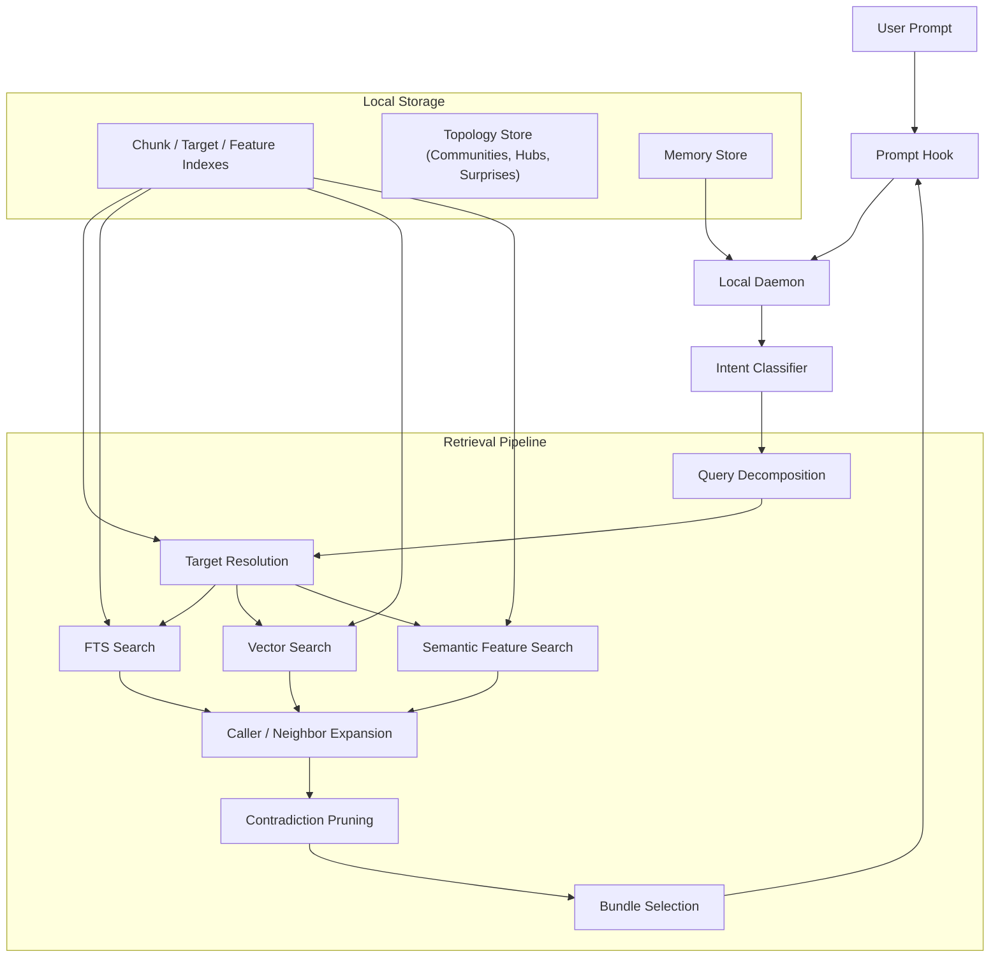
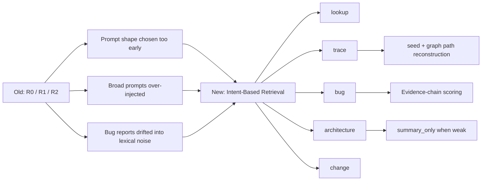

# Reporecall

```text
██████╗ ███████╗██████╗  ██████╗ ██████╗ ███████╗ ██████╗ █████╗ ██╗     ██╗
██╔══██╗██╔════╝██╔══██╗██╔═══██╗██╔══██╗██╔════╝██╔════╝██╔══██╗██║     ██║
██████╔╝█████╗  ██████╔╝██║   ██║██████╔╝█████╗  ██║     ███████║██║     ██║
██╔══██╗██╔══╝  ██╔═══╝ ██║   ██║██╔══██╗██╔══╝  ██║     ██╔══██║██║     ██║
██║  ██║███████╗██║     ╚██████╔╝██║  ██║███████╗╚██████╗██║  ██║███████╗███████╗
╚═╝  ╚═╝╚══════╝╚═╝      ╚═════╝ ╚═╝  ╚═╝╚══════╝ ╚═════╝╚═╝  ╚═╝╚══════╝╚══════╝
```

Local codebase memory and retrieval for Claude Code and MCP.

Reporecall indexes your repository locally, classifies each query by intent, and injects focused code context or a bounded summary before Claude answers.

## Quick Start

```bash
npm install -g @proofofwork-agency/reporecall

reporecall init
reporecall index
reporecall serve
```

## v0.5.0 - Topology-Aware Search & Architecture Decomposition

This release adds **codebase topology analysis** and decomposes the search engine into focused strategy modules.

### What's new

**Topology analysis pipeline.** After each index, reporecall runs Louvain community detection on the call graph, identifies architectural hub nodes, scores surprising cross-boundary connections, and generates investigation questions. Results are persisted in SQLite and injected into prompt context automatically.

**4 new MCP tools** for exploring codebase structure:

| Tool | What it returns |
|------|-----------------|
| `get_communities` | Module clusters with cohesion scores and auto-generated labels |
| `get_hub_nodes` | Most-connected nodes (architectural hubs) in the call graph |
| `get_surprises` | Unexpected cross-boundary connections ranked by surprise score |
| `suggest_investigations` | Auto-generated investigation questions about weak spots |

**Community-aware search scoring.** Results from the same Louvain community as the query seed receive a locality boost, improving architecture and trace queries.

**Daemon hardening.** Index scheduler queues are bounded at 50k entries. File watcher has backpressure at 10k pending events. Shutdown timeout is now configurable via `shutdownTimeoutMs`.

**Hook request validation.** All hook endpoints now validate request bodies with Zod schemas, returning 400 with details on malformed payloads instead of silently misbehaving.

**Search architecture decomposition.** The monolithic `hybrid.ts` (~6,800 lines) was split into 7 focused modules: `pipeline-core`, `bug-strategy`, `architecture-strategy`, `trace-strategy`, `lookup-strategy`, `context-prioritization`, and the thin `hybrid` orchestrator. No public API changes.

**New configuration:**
- `shutdownTimeoutMs` (1000-60000, default 10000) - configurable graceful shutdown timeout

**Other improvements:**
- Tree-sitter parse timeout (5s) prevents hangs on malformed files
- `reporecall mcp` warns when a daemon is already running (SQLite lock contention risk)
- Ollama health check added to the `mcp` command
- Bug intent classifier now recognizes plural forms ("bugs", "issues", "problems")
- New dependencies: `graphology`, `graphology-communities-louvain` for graph analysis

### How to use the topology tools

The topology data is computed automatically during indexing. No extra setup needed.

```bash
# Re-index to generate topology data
reporecall index

# Start the daemon (topology tools are available via MCP)
reporecall serve
```

In Claude Code, the topology summary is injected automatically into every prompt context. For deeper exploration, use the MCP tools directly:

- Ask "what are the main module clusters?" - triggers `get_communities`
- Ask "what are the most connected functions?" - triggers `get_hub_nodes`
- Ask "any surprising connections in the codebase?" - triggers `get_surprises`
- Ask "what should I investigate?" - triggers `suggest_investigations`

### Previous releases

<details>
<summary>v0.4.1 - Claude Hook Compatibility Fix</summary>

This patch fixes Claude hook token lookup for real `claude -p` / headless sessions. Reporecall-generated hooks now fall back to `$PWD` when `$CLAUDE_PROJECT_DIR` is unavailable, so injected context reaches Claude reliably in local CLI sessions after re-running `reporecall init`.
</details>

<details>
<summary>v0.4.0 - Intent-Based Retrieval Overhaul</summary>

This release replaces the old `R0 / R1 / R2` routing model with intent-based query modes. The old model described retrieval shape (exact, trace, broad), the new model describes what the user actually wants:

| Mode           | Purpose                                                               |
| -------------- | --------------------------------------------------------------------- |
| `lookup`       | Exact symbol, file, endpoint, or module lookup                        |
| `trace`        | Implementation path - "how does X work", "what calls Y"               |
| `bug`          | Causal debugging - symptom descriptions, "why does this fail"         |
| `architecture` | Broad inventory - "which files implement...", "full flow from A to B" |
| `change`       | Cross-cutting edits - "add logging across the auth flow"              |
| `skip`         | Meta/chat/non-code prompts                                            |

Other changes in this release: streaming windowed indexing, adaptive embedding batches, semantic feature extraction, `summary_only` delivery for low-confidence bundles, PreToolUse hook guidance, and SQLite ABI self-repair.
</details>

## Features

- **Intent-based retrieval** - query mode selected by local rule-based classification, no LLM
- **Multi-signal search** - FTS keywords, vector similarity, AST metadata, semantic features, imports, call graphs
- **Topology analysis** - Louvain community detection, hub node identification, surprise scoring, investigation suggestions
- **Bug localization** - dedicated pipeline with subject profiling, contradiction pruning, and graph expansion
- **Delivery modes** - `code_context` (focused chunks) or `summary_only` (structured summary when confidence is low)
- **Hook guidance** - context strength, execution surface, missing evidence, and recommended next reads
- **Local memory** - persistent rules, facts, episodes, and working context across sessions
- **Streaming indexer** - bounded file windows, adaptive embedding batches, lower peak heap
- **SQLite ABI self-repair** - detects native module mismatch and attempts automatic rebuild
- **MCP server** - `search_code`, `find_callers`, `get_symbol`, `explain_flow`, topology tools, memory tools, and more

## Architecture





## CLI

```bash
reporecall init          # Create .memory/, hooks, MCP config
reporecall index         # Index the codebase
reporecall serve         # Start daemon + file watcher
reporecall explain       # Inspect retrieval for a query
reporecall mcp           # Run as MCP server (stdio)
reporecall doctor        # Health checks
reporecall search        # Direct search
reporecall stats         # Index statistics
reporecall graph         # Call graph queries
reporecall conventions   # Detected conventions
```

## MCP Tools

`search_code`, `find_callers`, `find_callees`, `get_symbol`, `get_imports`, `explain_flow`, `build_stack_tree`, `resolve_seed`, `index_codebase`, `get_stats`, `clear_index`, `get_communities`, `get_hub_nodes`, `get_surprises`, `suggest_investigations`, `recall_memories`, `store_memory`, `forget_memory`, `list_memories`, `explain_memory`, `compact_memories`, `clear_working_memory`

## Development

```bash
npm install
npm run build
npm test
```

## License

MIT
