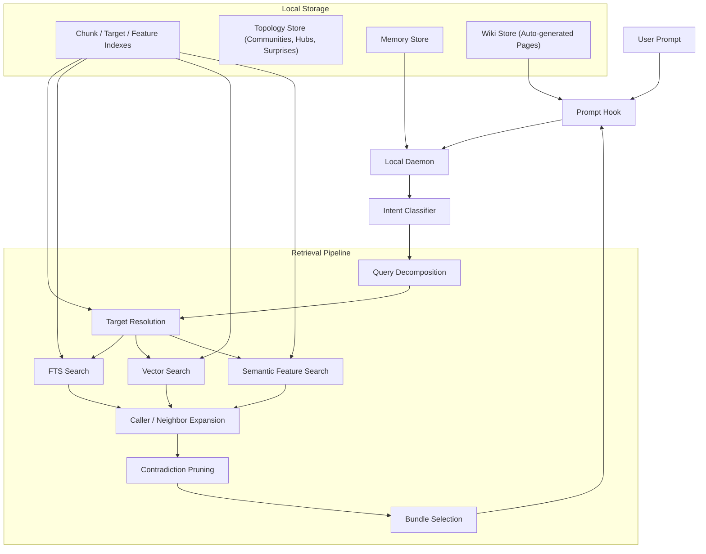
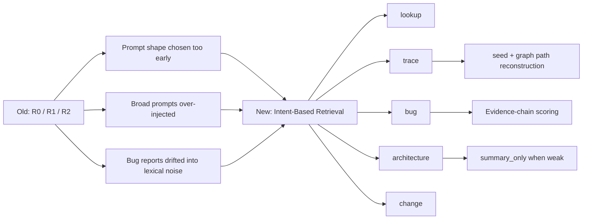

# Reporecall

```text
██████╗ ███████╗██████╗  ██████╗ ██████╗ ███████╗ ██████╗ █████╗ ██╗     ██╗
██╔══██╗██╔════╝██╔══██╗██╔═══██╗██╔══██╗██╔════╝██╔════╝██╔══██╗██║     ██║
██████╔╝█████╗  ██████╔╝██║   ██║██████╔╝█████╗  ██║     ███████║██║     ██║
██╔══██╗██╔══╝  ██╔═══╝ ██║   ██║██╔══██╗██╔══╝  ██║     ██╔══██║██║     ██║
██║  ██║███████╗██║     ╚██████╔╝██║  ██║███████╗╚██████╗██║  ██║███████╗███████╗
╚═╝  ╚═╝╚══════╝╚═╝      ╚═════╝ ╚═╝  ╚═╝╚══════╝ ╚═════╝╚═╝  ╚═╝╚══════╝╚══════╝
```

Local codebase memory and retrieval for Claude Code and MCP.

Reporecall indexes your repository locally, classifies each query by intent, and injects focused code context or a bounded summary before Claude answers.

## Quick Start

```bash
npm install -g @proofofwork-agency/reporecall

reporecall init
reporecall index
reporecall serve
```

## v0.6.0 - Wiki Layer & Memory Precision

This release adds an **always-on wiki layer** for persistent codebase knowledge and fixes three memory retrieval bugs that caused noisy or missing context injection.

Inspired by [Andrej Karpathy's LLM Wiki](https://www.mindstudio.ai/blog/andrej-karpathy-llm-wiki-knowledge-base-claude-code) concept — structured markdown knowledge bases that LLMs can query efficiently. Reporecall automates wiki generation from code topology (hub nodes, flow traces, surprise connections) and enriches pages with optional LLM summaries.

### What's new

**Wiki layer.** Auto-generated wiki pages from codebase topology are indexed alongside code and injected into every prompt context within a configurable token budget. No manual authoring required — pages are created during indexing from hub nodes, flow traces, and architectural surprises.

**5 new MCP tools** for wiki management:

| Tool | What it does |
|------|-------------|
| `wiki_query` | Search wiki pages by topic |
| `wiki_read` | Read a specific wiki page |
| `wiki_write` | Create or update a wiki page |
| `wiki_check_staleness` | Find wiki pages that may be outdated |

**FTS5 phrase query fix.** Stop words ("how", "does", "work") were included in phrase queries, causing FTS5 to match only exact phrases and short-circuit before AND/OR fallback. Queries like "how does image generation work" now correctly find wiki pages matching "image generation".

**Memory type isolation.** Wiki pages (type `wiki`) no longer leak into memory search results. The memory search pipeline now explicitly filters to `user`, `feedback`, `project`, and `reference` types, while wiki has its own dedicated search path.

**Access count penalty.** Over-accessed memories that matched most queries due to broad keywords are now penalized: >15 accesses → 0.5x score, >8 accesses → 0.75x. This prevents generic feedback rules from drowning out topic-specific results.

**Tighter relevance threshold.** The relative score threshold was raised from 0.70 to 0.85, filtering out low-relevance results that scored far below the top hit within a filtered set.

### Benchmark results (DUTO codebase, 1,140 files, 30 queries)

| Layer | Precision | Hit Rate | Notes |
|-------|-----------|----------|-------|
| Code | 57% | 100% | Always injected |
| Wiki | 100% | 50% | Only injects when relevant pages exist |
| Memory | 73% | ~60% | After access penalty + threshold fix |

**New configuration:**
- `wikiBudget` (default 400) — max tokens for wiki injection per prompt
- `wikiMaxPages` (default 3) — max wiki pages injected per prompt

## v0.5.0 - Topology-Aware Search & Architecture Decomposition

This release adds **codebase topology analysis** and decomposes the search engine into focused strategy modules.

### What's new

**Topology analysis pipeline.** After each index, reporecall runs Louvain community detection on the call graph, identifies architectural hub nodes, scores surprising cross-boundary connections, and generates investigation questions. Results are persisted in SQLite and injected into prompt context automatically.

**4 new MCP tools** for exploring codebase structure:

| Tool | What it returns |
|------|-----------------|
| `get_communities` | Module clusters with cohesion scores and auto-generated labels |
| `get_hub_nodes` | Most-connected nodes (architectural hubs) in the call graph |
| `get_surprises` | Unexpected cross-boundary connections ranked by surprise score |
| `suggest_investigations` | Auto-generated investigation questions about weak spots |

**Community-aware search scoring.** Results from the same Louvain community as the query seed receive a locality boost, improving architecture and trace queries.

**Daemon hardening.** Index scheduler queues are bounded at 50k entries. File watcher has backpressure at 10k pending events. Shutdown timeout is now configurable via `shutdownTimeoutMs`.

**Hook request validation.** All hook endpoints now validate request bodies with Zod schemas, returning 400 with details on malformed payloads instead of silently misbehaving.

**Search architecture decomposition.** The monolithic `hybrid.ts` (~6,800 lines) was split into 7 focused modules: `pipeline-core`, `bug-strategy`, `architecture-strategy`, `trace-strategy`, `lookup-strategy`, `context-prioritization`, and the thin `hybrid` orchestrator. No public API changes.

**New configuration:**
- `shutdownTimeoutMs` (1000-60000, default 10000) - configurable graceful shutdown timeout

**Other improvements:**
- Tree-sitter parse timeout (5s) prevents hangs on malformed files
- `reporecall mcp` warns when a daemon is already running (SQLite lock contention risk)
- Ollama health check added to the `mcp` command
- Bug intent classifier now recognizes plural forms ("bugs", "issues", "problems")
- New dependencies: `graphology`, `graphology-communities-louvain` for graph analysis

### How to use the topology tools

The topology data is computed automatically during indexing. No extra setup needed.

```bash
# Re-index to generate topology data
reporecall index

# Start the daemon (topology tools are available via MCP)
reporecall serve
```

In Claude Code, the topology summary is injected automatically into every prompt context. For deeper exploration, use the MCP tools directly:

- Ask "what are the main module clusters?" - triggers `get_communities`
- Ask "what are the most connected functions?" - triggers `get_hub_nodes`
- Ask "any surprising connections in the codebase?" - triggers `get_surprises`
- Ask "what should I investigate?" - triggers `suggest_investigations`

### Showcase: Topology & Flow Tools (real output from a 1,140-file codebase)

<details>
<summary><code>get_communities</code> — Module clusters with cohesion scores</summary>

```json
[
  { "id": "c_0", "nodeCount": 305, "cohesion": 0.01, "label": "api: json, getCorsHeaders" },
  { "id": "c_1", "nodeCount": 283, "cohesion": 0.01, "label": "components: updateNode, runFromNode" },
  { "id": "c_2", "nodeCount": 252, "cohesion": 0.01, "label": "components: observe, disconnect" },
  { "id": "c_3", "nodeCount": 227, "cohesion": 0.02, "label": "components+hooks: success, useAuth" },
  { "id": "c_4", "nodeCount": 220, "cohesion": 0.02, "label": "lib: isArray, updateNodeRun" },
  { "id": "c_5", "nodeCount": 153, "cohesion": 0.02, "label": "api: assertEquals, sanitizePrompt" },
  { "id": "c_6", "nodeCount": 132, "cohesion": 0.02, "label": "lib: warn, FloatingActionBar" },
  { "id": "c_7", "nodeCount": 121, "cohesion": 0.02, "label": "components: render, useTheme" }
]
```

Automatically detects tightly-coupled module clusters using Louvain community detection on the call graph.
</details>

<details>
<summary><code>get_hub_nodes</code> — Architectural hubs (most-connected functions)</summary>

```
 #  Name              File                                            Edges  Community
 1  json              api/gateway/index.ts                               135  api
 2  updateNode        lib/execution/workflow/WorkflowStore.ts            127  components
 3  isArray           lib/flow/typeGuards.ts                              94  lib
 4  success           lib/events/eventBus.ts                              70  hooks
 5  render            components/ErrorBoundary.tsx                        62  components
 6  asNumber          lib/editor/effects/registry.ts                      55  editor
 7  runFromNode       lib/execution/workflow/starter.ts                   52  components
 8  getCorsHeaders    api/_shared/cors.ts                                 50  api
 9  sanitizePrompt    api/_shared/prompt-sanitizer.ts                     46  api
10  processStep       lib/flow/graphBuilder/core/router.ts                44  graphBuilder
```

Identifies functions that would cause the most disruption if changed — the structural load-bearing walls of your codebase.
</details>

<details>
<summary><code>get_surprises</code> — Unexpected cross-boundary connections</summary>

```
Score  Source → Target                                           Why
  7    saveToLibrary → ExtensionCard                             weakly-resolved, crosses backend ↔ UI,
       (job-completion.ts → card.tsx)                            crosses execution surfaces

  6    transcribe → TranscriptionPanel                           weakly-resolved, crosses services ↔ components
       (transcription-service.ts → transcription-panel.tsx)

  6    useToast → Toaster                                        crosses hooks ↔ components,
       (use-toast.ts → toaster.tsx)                              peripheral node reaches hub

  6    getExecutionPathNodeIds → getDownstreamNodeIds            bridges communities 11 → 1,
       (useWorkflowCost.ts → graphTraversal.ts)                 crosses state ↔ shared execution surfaces

  6    compileSystemPrompt → memo_handler                        weakly-resolved, crosses lib ↔ components
       (promptTemplates.ts → PromptNode.tsx)
```

Surfaces connections that shouldn't exist or deserve closer inspection — potential coupling violations, false positives in the graph, or legitimate but non-obvious architectural bridges.
</details>

<details>
<summary><code>suggest_investigations</code> — Auto-generated investigation questions</summary>

```
Type              Question
weak_resolution   What is the exact relationship between RecoveryPollingQueue
                  and useRecovery? (alias_path across services ↔ hooks)

weak_resolution   What is the exact relationship between useTemplates and
                  EditorSidebar? (alias_path across hooks ↔ components)

bridge_node       Why does `cn` connect 8 structurally distant communities?
                  (High betweenness centrality)

bridge_node       Why does `updateNode` connect Inspector, ActionBar,
                  isArray, and useAuth? (Bridges distant modules)

verify_inferred   Are the 18 weakly-resolved relationships involving `error`
                  actually correct? (Hub node with alias-resolved edges)

isolated_nodes    What connects defineConfig_handler, SitemapEntry,
                  generateSitemapXml to the rest of the system?
                  (5 weakly-connected nodes — possible documentation gaps)
```

Tells you where to look next — no prompt engineering required.
</details>

<details>
<summary><code>explain_flow</code> — Trace execution across files</summary>

Query: `handleRetryAction`

```
Callers (who invokes this):
  ← handleBatchExecution           (batchProcessor.ts)
  ← triggerDownstreamNodes         (downstreamTrigger.ts)
  ← executeNode                    (nodeExecutor.ts)

Seed:
  ► handleRetryAction              (retryManager.ts:126-196)
    Extracts retry action, clears downstream execution state,
    resets node statuses, re-executes from target node

Callees (what this invokes):
  → getDownstreamNodeIds           (graphTraversal.ts:15-32)
  → addLog                         (workflowStore.ts:134-139)
```

Returns the full function source of the seed plus caller/callee code — one MCP call, 899 tokens, 6 files traced.
</details>

<details>
<summary><code>build_stack_tree</code> — Full call hierarchy</summary>

Query: `runWorkflow` (depth: 2, direction: both)

```
                 StartNode.tsx (memo_handler)
                 InpaintNode.tsx (useCallback_handler)
                 ActionBar.tsx
                        │
                        ▼
              ► runWorkflow (starter.ts)
                        │
            ┌───────────┼───────────┐
            ▼           ▼           ▼
     ensureFlowSaved  addLog   workflowStarted
     (ensureFlowSaved.ts) (workflowStore.ts) (activityLogger.ts)
            │                       │
       ┌────┴────┐                  ▼
       ▼         ▼              info (logger.ts)
 serializeFlow  saveToDatabase
 (serialization.ts) (dataService.ts)
```

10 nodes, 9 edges, 2 levels deep. Pure static analysis — zero LLM cost.
</details>

### Previous releases

<details>
<summary>v0.4.1 - Claude Hook Compatibility Fix</summary>

This patch fixes Claude hook token lookup for real `claude -p` / headless sessions. Reporecall-generated hooks now fall back to `$PWD` when `$CLAUDE_PROJECT_DIR` is unavailable, so injected context reaches Claude reliably in local CLI sessions after re-running `reporecall init`.
</details>

<details>
<summary>v0.4.0 - Intent-Based Retrieval Overhaul</summary>

This release replaces the old `R0 / R1 / R2` routing model with intent-based query modes. The old model described retrieval shape (exact, trace, broad), the new model describes what the user actually wants:

| Mode           | Purpose                                                               |
| -------------- | --------------------------------------------------------------------- |
| `lookup`       | Exact symbol, file, endpoint, or module lookup                        |
| `trace`        | Implementation path - "how does X work", "what calls Y"               |
| `bug`          | Causal debugging - symptom descriptions, "why does this fail"         |
| `architecture` | Broad inventory - "which files implement...", "full flow from A to B" |
| `change`       | Cross-cutting edits - "add logging across the auth flow"              |
| `skip`         | Meta/chat/non-code prompts                                            |

Other changes in this release: streaming windowed indexing, adaptive embedding batches, semantic feature extraction, `summary_only` delivery for low-confidence bundles, PreToolUse hook guidance, and SQLite ABI self-repair.
</details>

## Features

- **Intent-based retrieval** - query mode selected by local rule-based classification, no LLM
- **Multi-signal search** - FTS keywords, vector similarity, AST metadata, semantic features, imports, call graphs
- **Topology analysis** - Louvain community detection, hub node identification, surprise scoring, investigation suggestions
- **Bug localization** - dedicated pipeline with subject profiling, contradiction pruning, and graph expansion
- **Delivery modes** - `code_context` (focused chunks) or `summary_only` (structured summary when confidence is low)
- **Hook guidance** - context strength, execution surface, missing evidence, and recommended next reads
- **Wiki layer** - auto-generated knowledge pages from topology, always-on injection with token budgeting
- **Local memory** - persistent rules, facts, episodes, and working context across sessions
- **Streaming indexer** - bounded file windows, adaptive embedding batches, lower peak heap
- **SQLite ABI self-repair** - detects native module mismatch and attempts automatic rebuild
- **MCP server** - `search_code`, `find_callers`, `get_symbol`, `explain_flow`, topology tools, memory tools, and more

## Architecture





## CLI

```bash
reporecall init          # Create .memory/, hooks, MCP config
reporecall index         # Index the codebase
reporecall serve         # Start daemon + file watcher
reporecall explain       # Inspect retrieval for a query
reporecall mcp           # Run as MCP server (stdio)
reporecall doctor        # Health checks
reporecall search        # Direct search
reporecall stats         # Index statistics
reporecall graph         # Call graph queries
reporecall conventions   # Detected conventions
```

## MCP Tools

`search_code`, `find_callers`, `find_callees`, `get_symbol`, `get_imports`, `explain_flow`, `build_stack_tree`, `resolve_seed`, `index_codebase`, `get_stats`, `clear_index`, `get_communities`, `get_hub_nodes`, `get_surprises`, `suggest_investigations`, `recall_memories`, `store_memory`, `forget_memory`, `list_memories`, `explain_memory`, `compact_memories`, `clear_working_memory`, `wiki_query`, `wiki_read`, `wiki_write`, `wiki_check_staleness`

## Development

```bash
npm install
npm run build
npm test
```

## License

MIT
