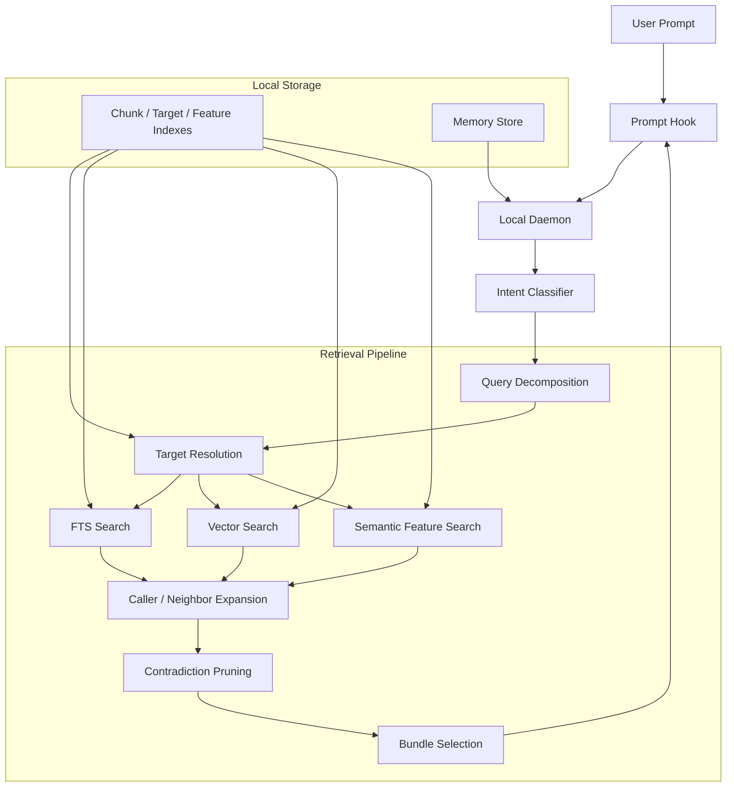
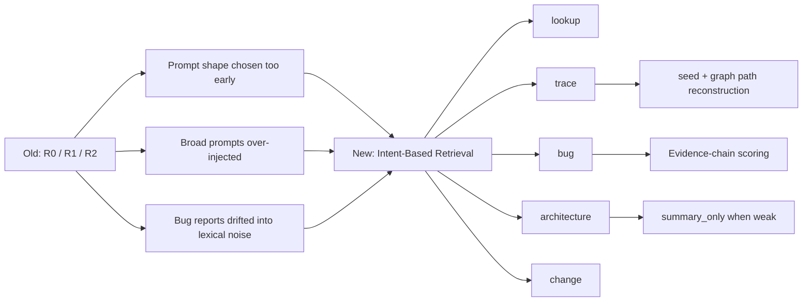

# Reporecall

```text
██████╗ ███████╗██████╗  ██████╗ ██████╗ ███████╗ ██████╗ █████╗ ██╗     ██╗
██╔══██╗██╔════╝██╔══██╗██╔═══██╗██╔══██╗██╔════╝██╔════╝██╔══██╗██║     ██║
██████╔╝█████╗  ██████╔╝██║   ██║██████╔╝█████╗  ██║     ███████║██║     ██║
██╔══██╗██╔══╝  ██╔═══╝ ██║   ██║██╔══██╗██╔══╝  ██║     ██╔══██║██║     ██║
██║  ██║███████╗██║     ╚██████╔╝██║  ██║███████╗╚██████╗██║  ██║███████╗███████╗
╚═╝  ╚═╝╚══════╝╚═╝      ╚═════╝ ╚═╝  ╚═╝╚══════╝ ╚═════╝╚═╝  ╚═╝╚══════╝╚══════╝
```

Local codebase memory and retrieval for Claude Code and MCP.

Reporecall indexes your repository locally, classifies each query by intent, and injects focused code context or a bounded summary before Claude answers.

## Quick Start

```bash
npm install -g @proofofwork-agency/reporecall

reporecall init
reporecall index
reporecall serve
```

## v0.4.1 — Claude Hook Compatibility Fix

This patch fixes Claude hook token lookup for real `claude -p` / headless sessions. Reporecall-generated hooks now fall back to `$PWD` when `$CLAUDE_PROJECT_DIR` is unavailable, so injected context reaches Claude reliably in local CLI sessions after re-running `reporecall init`.

## v0.4.0 — Intent-Based Retrieval Overhaul

This release replaces the old `R0 / R1 / R2` routing model with intent-based query modes. The old model described retrieval shape (exact, trace, broad) — the new model describes what the user actually wants:

| Mode | Purpose |
|------|---------|
| `lookup` | Exact symbol, file, endpoint, or module lookup |
| `trace` | Implementation path — "how does X work", "what calls Y" |
| `bug` | Causal debugging — symptom descriptions, "why does this fail" |
| `architecture` | Broad inventory — "which files implement…", "full flow from A to B" |
| `change` | Cross-cutting edits — "add logging across the auth flow" |
| `skip` | Meta/chat/non-code prompts |

Other changes in this release: streaming windowed indexing, adaptive embedding batches, semantic feature extraction, `summary_only` delivery for low-confidence bundles, PreToolUse hook guidance, and SQLite ABI self-repair.

## Features

- **Intent-based retrieval** — query mode selected by local rule-based classification, no LLM
- **Multi-signal search** — FTS keywords, vector similarity, AST metadata, semantic features, imports, call graphs
- **Bug localization** — dedicated pipeline with subject profiling, contradiction pruning, and graph expansion
- **Delivery modes** — `code_context` (focused chunks) or `summary_only` (structured summary when confidence is low)
- **Hook guidance** — context strength, execution surface, missing evidence, and recommended next reads
- **Local memory** — persistent rules, facts, episodes, and working context across sessions
- **Streaming indexer** — bounded file windows, adaptive embedding batches, lower peak heap
- **SQLite ABI self-repair** — detects native module mismatch and attempts automatic rebuild
- **MCP server** — `search_code`, `find_callers`, `get_symbol`, `explain_flow`, memory tools, and more

## Architecture





## CLI

```bash
reporecall init          # Create .memory/, hooks, MCP config
reporecall index         # Index the codebase
reporecall serve         # Start daemon + file watcher
reporecall explain       # Inspect retrieval for a query
reporecall mcp           # Run as MCP server (stdio)
reporecall doctor        # Health checks
reporecall search        # Direct search
reporecall stats         # Index statistics
reporecall graph         # Call graph queries
reporecall conventions   # Detected conventions
```

## MCP Tools

`search_code`, `find_callers`, `find_callees`, `get_symbol`, `get_imports`, `explain_flow`, `build_stack_tree`, `resolve_seed`, `index_codebase`, `get_stats`, `clear_index`, `recall_memories`, `store_memory`, `forget_memory`, `list_memories`, `explain_memory`, `compact_memories`, `clear_working_memory`

## Development

```bash
npm install
npm run build
npm test
```

Key source files: `src/search/intent.ts`, `src/search/hybrid.ts`, `src/search/context-assembler.ts`, `src/indexer/pipeline.ts`, `src/daemon/server.ts`, `src/memory/`

## License

MIT
