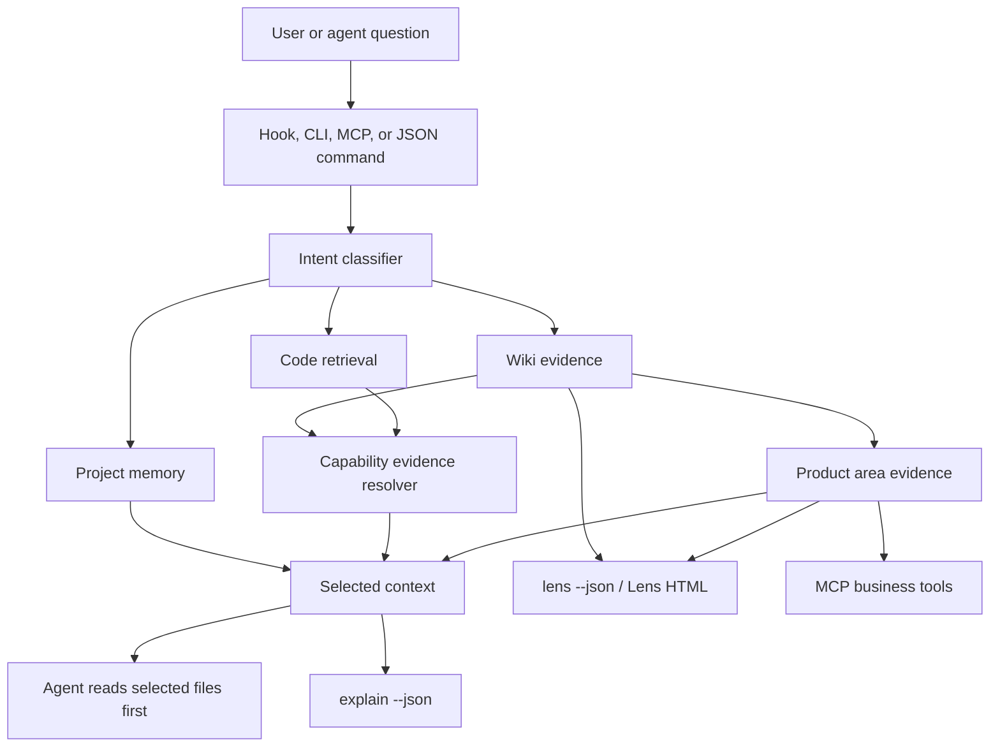
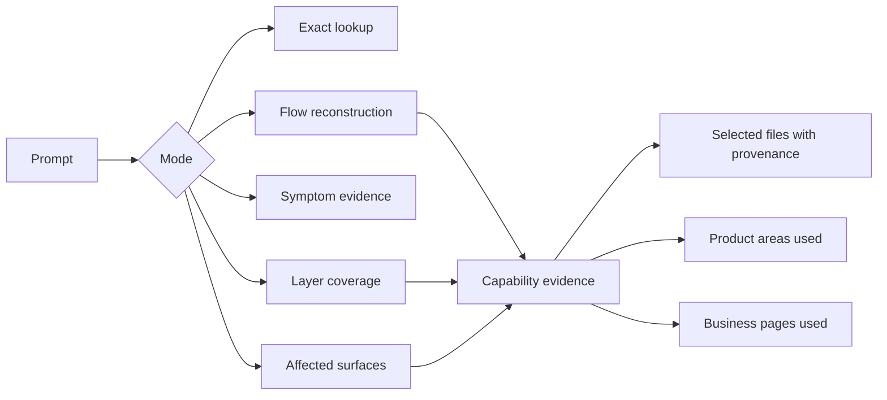

# Reporecall

```text
 ____                                    _ _
|  _ \ ___ _ __   ___  _ __ ___  ___ __ _| | |
| |_) / _ \ '_ \ / _ \| '__/ _ \/ __/ _` | | |
|  _ <  __/ |_) | (_) | | |  __/ (_| (_| | | |
|_| \_\___| .__/ \___/|_|  \___|\___\__,_|_|_|
          |_|
```

Local codebase memory, intent-routed retrieval, generated wiki pages, and an architecture lens for Claude Code, Codex, and MCP-compatible coding agents.

Reporecall indexes a repository locally, classifies codebase questions by intent, and returns focused source context through Claude Code hooks, MCP tools, and CLI commands. Codex and other agent clients can use Reporecall through the MCP server or direct CLI commands. Reporecall also generates deterministic wiki pages and a `lens --json` export that other tools can consume without depending on Reporecall internals.

No cloud embeddings API is required. The default keyword provider uses local SQLite/FTS indexes; optional semantic backends can be configured separately.

## Quick Start

```bash
npm install -g @proofofwork-agency/reporecall

reporecall init          # Create .memory/, hooks, MCP config
reporecall index         # Index the codebase (builds topology + wiki)
reporecall serve         # Start daemon + file watcher
reporecall lens --serve  # Open the architecture dashboard
```

That's it. Context is injected automatically into every Claude Code prompt via hooks, wiki pages regenerate as the code changes, and the lens dashboard is always one command away.

---

### Lens — interactive architecture dashboard

One command, one HTML file, your whole codebase at a glance:

```bash
reporecall lens --serve --open
```

`reporecall init` only writes project configuration, Claude hook settings, MCP config, and memory directories. It does not index code.

`reporecall serve` runs an initial incremental index on startup, generates wiki pages from the resulting index, and then keeps the index fresh through the file watcher. If you want a one-off foreground index without starting the daemon, run `reporecall index` — it indexes the codebase and generates the same deterministic wiki/business pages before exiting (pass `--no-wiki` to skip).

Common direct commands:

```bash
reporecall explain "which files implement authentication?"
reporecall search "checkout session"
reporecall mcp --project .
reporecall lens --json
```

## What Reporecall Provides

- **Intent-routed retrieval** for `lookup`, `trace`, `bug`, `architecture`, `change`, and `skip` prompts.
- **Capability evidence selection** that uses code matches, wiki capability pages, related files, imports, call neighbors, and mandatory flow hints to recommend concrete files.
- **Generated and stored wiki pages** for communities, hubs, cross-module surprises, captured flows or explorations, and business capability views.
- **Business context export and query APIs** through `reporecall lens --json`, `reporecall explain --json`, and MCP business-context tools.
- **Agent context** for Claude Code hooks, Codex through MCP/CLI, and other local coding agents.
- **MCP tools** for code search, call graphs, business context, topology, wiki, memory, and index management.
- **Architecture lens** as a portable HTML dashboard plus structured JSON.

## How Agents Use It

Reporecall has three integration surfaces: automatic Claude Code hooks, MCP/CLI access for Codex and other coding agents, and structured exports for external tools.

### Claude Code

`reporecall init` wires Reporecall directly into Claude Code:

- creates `.memory/config.json` and `.memoryignore`;
- creates `.claude/settings.json` hook entries;
- adds a Reporecall section to `CLAUDE.md`;
- creates `.mcp.json` with a `reporecall` MCP server entry.

When `reporecall serve` is running, Claude Code hooks call the local daemon:

| Hook | What Reporecall returns |
| --- | --- |
| `SessionStart` | Project guidance and memory instructions. |
| `UserPromptSubmit` | Relevant codebase context for the current prompt. |

The injected prompt context can include selected files, symbols, call graph evidence, wiki evidence, compact product-area evidence, memories, confidence, missing evidence, and recommended next reads. Claude should answer from that injected context first, then use MCP tools or normal file tools only for gaps.

### Codex

Codex uses Reporecall through the open MCP and CLI surfaces rather than Claude Code hooks.

Use MCP for interactive agent work:

```bash
reporecall mcp --project .
```

Use CLI commands for scriptable context:

```bash
reporecall explain --json "which files implement billing?"
reporecall search "billing controller"
reporecall lens --json
```

In Codex, the MCP tools are the main live interface for code search, flow navigation, business context, wiki reads, memory reads/writes, topology, and index management. The CLI is useful when an agent or script wants deterministic JSON without maintaining an MCP session.

### Other Tools

External utilities should depend on the public outputs, not Reporecall internals:

| Surface | Best use |
| --- | --- |
| MCP server | Live code search, graph navigation, wiki/memory access, and indexing. |
| `refresh_context` | External-tool refresh entry point: re-index code, regenerate wiki/business pages, and return updated stats. |
| `get_lens_data` | Read-only MCP export for current Lens JSON, with options to omit raw wiki content or graph-heavy arrays. |
| `business_context_query` / `list_product_areas` | Business-facing entry points that default to presentation-safe records; `list_product_areas` can include unsafe diagnostics when requested. |
| `wiki_read` | Read a wiki page by slug; when generated slugs changed after regeneration, returns replacement suggestions instead of a dead-end miss. |
| `reporecall explain --json` | Per-question retrieval diagnostics, selected files, `productAreasUsed[]`, and `businessPagesUsed[]`. |
| `reporecall lens --json` | Whole-project topology, wiki graph, and business context export. |
| `productAreas[]` | Business-facing grouping over related capabilities, with `displayName`, `displaySummary`, and `areaKind`. |
| `businessPages[]` | Product-language capabilities with `displayName`, `displaySummary`, presentation quality metadata, and separated `technicalEvidence`. |

The business context export is intentionally additive. It gives planning tools, dashboards, and MCP wrappers product-facing language while preserving the core retrieval model as code/wiki/graph evidence.

Technical symbols, classes, and service names stay available as supporting evidence. They should not become the primary product-facing capability label when Reporecall can infer a clearer business phrase.

Use `displayName` and `displaySummary` for business-facing tools, and prefer records where `presentationSafe` is `true`. `displayQuality` and `presentationIssues` tell consumers when a generated label is high-confidence, thin, fallback-derived, or dominated by technical evidence. Use `technicalEvidence.files` and `technicalEvidence.symbols` only when a trusted technical client needs the source evidence behind a page or product area. The older `name`, `capability`, `summary`, `supportingFiles`, and `supportingSymbols` fields remain for compatibility and diagnostics.

Generated business wiki markdown keeps its narrative business-facing as well: the body reports evidence quality and counts, while concrete file and symbol names stay in structured evidence fields for technical clients.

Product areas are not a fixed taxonomy. Reporecall starts with common software-product areas, then can derive additional areas from the repository's own business terms and data concepts. This keeps the layer generic while letting domain language surface when the indexed code and wiki evidence support it.

Each product area includes `areaKind`: `fixed`, `discovered`, or `fallback`. External tools can use this to keep foundational product areas primary while treating repo-derived domain areas as supporting context when appropriate.

External tools can ask Reporecall to refresh itself through MCP. Use `refresh_context` after large file changes or before a planning workflow that needs fresh wiki/product-area context. It runs the same local indexing and deterministic wiki generation path that Reporecall uses for its own Lens and agent context. Then call `get_lens_data` for a read-only Lens JSON export over the current index. `index_codebase` remains available for lower-level indexing workflows and also regenerates wiki pages when the wiki layer is enabled.

## How It Works


```mermaid
flowchart TB
  Q["User or agent question"]
  Entry["Hook, CLI, MCP, or JSON command"]
  Intent["Intent classifier"]
  Search["Code retrieval"]
  Wiki["Wiki evidence"]
  Product["Product area evidence"]
  Memory["Project memory"]
  Resolver["Capability evidence resolver"]
  Selected["Selected context"]
  Agent["Agent reads selected files first"]
  Explain["explain --json"]
  Lens["lens --json / Lens HTML"]
  BusinessTools["MCP business tools"]

  Q --> Entry --> Intent
  Intent --> Search
  Intent --> Wiki
  Wiki --> Product
  Intent --> Memory
  Search --> Resolver
  Wiki --> Resolver
  Product --> Selected
  Resolver --> Selected
  Memory --> Selected
  Selected --> Agent
  Selected --> Explain
  Product --> Lens
  Wiki --> Lens
  Product --> BusinessTools
```

The important rule is file coverage over chunk volume. For trace and architecture questions, Reporecall tries to cover the relevant layers: entry/UI, state or service, controller or edge function, and shared helpers when those layers exist.

## Retrieval Modes

| Mode | Use case |
| --- | --- |
| `lookup` | Find an exact symbol, file, endpoint, or module. |
| `trace` | Explain how a flow works or what calls what. |
| `bug` | Localize likely files for a symptom or failure. |
| `architecture` | Inventory the files that implement a subsystem. |
| `change` | Find the places likely affected by a cross-cutting edit. |
| `skip` | Avoid code retrieval for non-code prompts. |


```mermaid
flowchart LR
  Query["Prompt"]
  Mode{"Mode"}
  Lookup["Exact lookup"]
  Trace["Flow reconstruction"]
  Bug["Symptom evidence"]
  Arch["Layer coverage"]
  Change["Affected surfaces"]

  Query --> Mode
  Mode --> Lookup
  Mode --> Trace
  Mode --> Bug
  Mode --> Arch
  Mode --> Change
  Trace --> Resolver["Capability evidence"]
  Arch --> Resolver
  Change --> Resolver
  Resolver --> Files["Selected files with provenance"]
  Resolver --> Areas["Product areas used"]
  Resolver --> Pages["Business pages used"]
```

## Capability Evidence

Capability evidence is generic. It does not encode customer/project names or repository-specific file lists.

For trace, architecture, and change prompts, Reporecall can:

- use matching wiki capability pages as anchors;
- hydrate their `relatedFiles` into real code chunks;
- add import and call neighbors from the graph;
- keep lookup prompts small and exact;
- suppress test/spec noise unless the query asks for tests.

Returned file records can include:

- `selectionSource`
- `selectionReason`
- `wikiPagesUsed`
- `missingEvidence`

## Business Context Export

Reporecall exposes product-language context in three places:

- `reporecall lens --json` for whole-project `productAreas[]` and `businessPages[]`.
- `reporecall explain --json` for query-specific `productAreasUsed[]` and `businessPagesUsed[]`.
- MCP tools `list_product_areas` and `business_context_query` for live agent access.

These surfaces are additive product-language views over code evidence for external tools.

The schema is documented in [docs/business-context-schema.md](docs/business-context-schema.md).

Key fields include:

- `productAreas[]`
- `displayName`
- `displaySummary`
- `areaKind`
- `displayQuality`
- `presentationSafe`
- `presentationIssues`
- `capability`
- `actor`
- `trigger`
- `businessTerms`
- `userActions`
- `decisionPoints`
- `sideEffects`
- `businessOutcome`
- `dataConcepts`
- `technicalEvidence`
- `externalSystems`
- `supportingFiles`
- `confidenceLabel`

Business context is not fed back into core search as hard-coded rules. Hooks may append a small budgeted product-area evidence section for trace, architecture, and change prompts, but lookup prompts stay small and code retrieval remains grounded in source/wiki/graph evidence. Consumers should treat the business layer as a read-only product map with supporting evidence.

## Lens

```bash
reporecall lens --serve --open
reporecall lens --json > lens.json
```

The HTML dashboard shows:

- overview stats;
- Louvain communities;
- high-degree hub nodes;
- surprising cross-module edges;
- generated wiki pages;
- product areas that group related business capability pages;
- business capability pages with product-facing summaries and supporting files.

The JSON export also includes machine-readable wiki graph data, `productAreas[]`, and `businessPages[]` for other tools.

## Comparison

Reporecall is a context layer, not a full AI editor, hosted model, or PR review SaaS. It is designed to improve the context that Claude Code, Codex, MCP clients, and other local coding agents receive.

For a paid/free competitor comparison across context layers, memory/rules, code graph support, business/product context, and local-first behavior, see [docs/reporecall-context-layer-competitor-comparison.md](docs/reporecall-context-layer-competitor-comparison.md).

## MCP Tools

Reporecall exposes a local MCP server:

```bash
reporecall mcp --project .
```

Use this server from Codex or any MCP-compatible client when you want code search, flow navigation, business context, wiki pages, memory, or topology data without relying on Claude Code hooks.

Main tool groups:

| Group | Tools |
| --- | --- |
| Code search | `search_context`, `search_code`, `read_code_chunk`, `get_symbol`, `resolve_seed` |
| Flow/navigation | `find_callers`, `find_callees`, `explain_flow`, `build_stack_tree`, `get_imports` |
| Business context | `list_product_areas`, `business_context_query` |
| Topology | `get_communities`, `get_hub_nodes`, `get_surprises`, `suggest_investigations` |
| Wiki | `wiki_query`, `wiki_read`, `wiki_write`, `wiki_check_staleness` |
| Memory | `recall_memories`, `store_memory`, `forget_memory`, `list_memories`, `explain_memory`, `compact_memories`, `clear_working_memory` |
| Index/context lifecycle | `refresh_context`, `get_lens_data`, `index_codebase`, `get_stats`, `clear_index` |

## Configuration

Configuration lives in `.memory/config.json`.

| Key | Default | Description |
| --- | --- | --- |
| `embeddingProvider` | `"keyword"` | Retrieval backend. `keyword` is local FTS-only. |
| `wikiBudget` | `400` | Max tokens for wiki injection per prompt. |
| `wikiMaxPages` | `3` | Max wiki pages injected per prompt. |
| `memoryBudget` | `500` | Max tokens for memory injection per prompt. |
| `capabilityEvidence` | `true` | Use code/wiki/graph evidence to select related files for trace, architecture, and change prompts. |
| `genericCapabilityHydration` | `true` | Hydrate broad inventory evidence into prompt context for questions like "which files implement...". |
| `contextCompressionMode` | `"auto"` | Compress secondary code evidence in assembled context. Use `"off"` to disable or `"always"` for diagnostics. |
| `contextCompressionPreserveTopChunks` | `1` | Number of top chunks kept as full source before secondary evidence can be compacted. |
| `contextCompressionMinChunkTokens` | `100` | Minimum chunk size before compression is attempted. |
| `contextCompressionTargetRatio` | `0.75` | Maximum compressed/full token ratio accepted for compacted evidence. |
| `topologyEnabled` | `true` | Run topology/community analysis after indexing. |
| `topologyMaxChunks` | `50000` | Skip full topology graph construction above this indexed chunk count. |
| `shutdownTimeoutMs` | `10000` | Graceful shutdown timeout in milliseconds. |

Assistant/client instruction files such as `AGENTS.md`, `CLAUDE.md`, `.claude/**`, `.codex/**`, and `.mcp.json` are ignored by default as code evidence.

## CLI Reference

```bash
reporecall init
reporecall index
reporecall serve
reporecall lens
reporecall explain "query"
reporecall search "query"
reporecall mcp
reporecall doctor
reporecall stats
reporecall graph
reporecall conventions
```

## Changelog

### v0.7.1 - Self-Evaluation Patch

Patch release driven by reporecall's self-evaluation on its own codebase. Tightens
seven defects in retrieval, capability evidence, indexing, and business-context
routing without breaking any public API.

- `reporecall index` now generates deterministic wiki/business pages at the end of an index pass so `list_product_areas`/`business_context_query` work without `serve`. Pass `--no-wiki` to skip.
- Intent classifier routes "what files would I need to change" and similar phrasings to change/architecture mode.
- Bulk file deletion in the indexer now uses a single transaction, fixing a SIGILL on large delete sets.
- Wiki/business `scoreFamilyEvidence` no longer publishes false auth capability pages for reporecall's own infra directories, while keeping downstream React `useAuth`/`useSession` hooks classified as authentication.
- Lookup primary seeds must share at least two non-generic anchors with the query to be returned as a high-score exact hit.
- Architecture/change queries drop test files entirely (vs the prior multiplicative penalty) unless the query mentions test/spec/e2e/fixture/mock.
- Capability evidence resolver now runs for lookup mode and gates non-family queries on actual file-path anchor overlap.
- Discovered product areas can override a weak fixed match only when their score exceeds it by at least `DISCOVERED_OVERRIDE_MARGIN` (3).

### v0.7.0 - Capability Evidence and Business Context Export

This release improves trace and architecture recall without adding project-specific rules.

- Added generic capability evidence resolution for trace, architecture, and change prompts.
- Business wiki pages can now act as evidence anchors without being blindly injected into prompt text.
- Wiki `relatedFiles` are hydrated into concrete source chunks when the query warrants it.
- Added `selectionSource`, `selectionReason`, and `wikiPagesUsed` metadata to selected files/chunks.
- Added `capabilityEvidence` and `genericCapabilityHydration` config flags.
- Added deterministic business capability wiki generation and stable `productAreas[]` / `businessPages[]` exports in `lens --json`.
- Added `areaKind` metadata for product areas so consumers can distinguish fixed, discovered, and fallback groupings.
- Added `displayQuality`, `presentationSafe`, and `presentationIssues` so business-facing tools can filter weak generated labels without losing technical evidence.
- Added Lens Product Areas and Business tabs for generated business capability pages.
- Added MCP business-context tools (`list_product_areas`, `business_context_query`), the lifecycle tool `refresh_context`, and the Lens export tool `get_lens_data`.
- Added a large-repo stress harness (`npm run stress:large-repo`, `npm run stress:large-repo:ci`) and chunk-count guardrails on topology/Lens graph construction.
- Documented Codex support through MCP and direct CLI usage.
- Added [docs/business-context-schema.md](docs/business-context-schema.md) for external utilities that want product-language context.
- Fixed rarest-term FTS fallback so zero-document terms do not dominate query planning.
- Fixed Lens metadata to use the target project root for `projectName` instead of the current shell directory.
- Filtered assistant/client instruction files from code evidence by default.
- Removed project/customer-specific examples from source tests and comments.

See [CHANGELOG.md](CHANGELOG.md) for the full package history.

## Development

```bash
npm install
npm run lint
npm test
npm run build
```

Useful verification:

```bash
npm test -- --run test/search test/hooks test/wiki test/visualize
npm run benchmark -- --provider keyword --output /tmp/reporecall-keyword.json
npm run stress:large-repo -- --files 10000 --changes 1000 --output /tmp/reporecall-large-repo.json
npm run stress:large-repo:ci
```

## License

MIT
