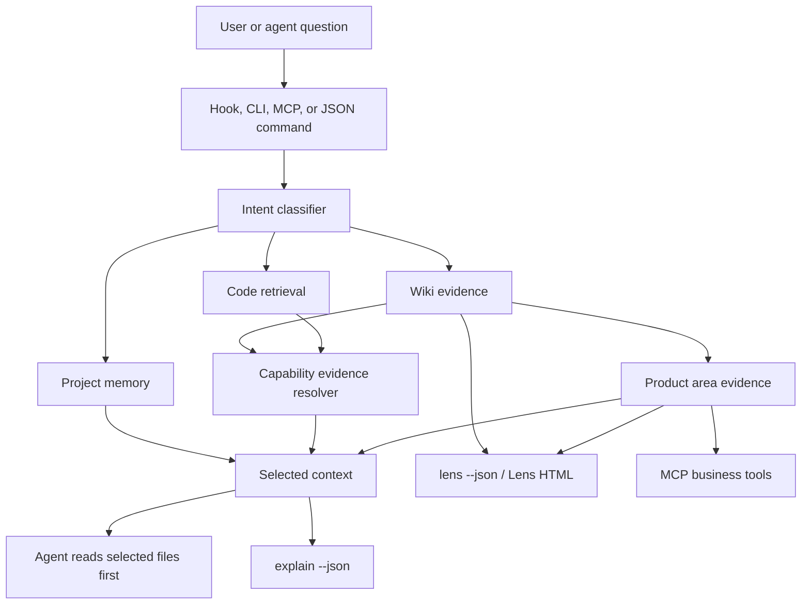
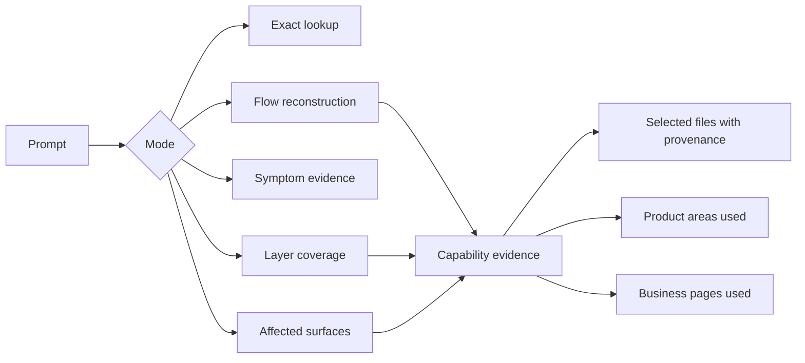

# Reporecall

```text
 ____                                    _ _
|  _ \ ___ _ __   ___  _ __ ___  ___ __ _| | |
| |_) / _ \ '_ \ / _ \| '__/ _ \/ __/ _` | | |
|  _ <  __/ |_) | (_) | | |  __/ (_| (_| | | |
|_| \_\___| .__/ \___/|_|  \___|\___\__,_|_|_|
          |_|
```

[](https://opensource.org/licenses/MIT) [](https://nodejs.org/) [](https://modelcontextprotocol.io/)

**Local-first context + memory for coding agents**  
Automatic injection + an explicit **Trust Contract** so agents (and you) always know when the context is fresh.

Reporecall helps Claude Code, Codex, Cline, Aider and other agents work more effectively on **large, high-churn or unfamiliar codebases**.

### What you actually get

- **Auto-injection via hooks** — relevant code, call graph, wiki, memory and business context are pushed into every prompt *before* the model starts thinking.
- **Brutally honest freshness** — every response includes `indexedCommit`, dirty-file count, and a clear banner when the index is EMPTY or STALE, plus direct guidance to `refresh_context`.
- **Smart local retrieval** — intent routing + hybrid search + graph expansion + extractive compression (expand any chunk on demand).
- **Persistent local memory** — rules, facts and working notes that survive across sessions.
- **Zero cloud by default** — no external vector DB, no recurring costs, works completely offline.

**v0.9.0 focus:** trustworthy retrieval evidence, unified project-boundary safety, deterministic quality gates, and behavior-preserving module decomposition.

### Standout Features
- **6-tool MCP surface** — deliberately small and reliable after the v0.8 surface collapse.
- **Deterministic Lens** — one HTML file + JSON export for the whole codebase topology, communities, and business context.
- **Full-stack local** — code indexing, call-graph analysis, wiki generation, business context, and memory — all without leaving your machine.

```
User prompt
    │
    ▼
Claude Code hook ──► Reporecall (local)
    │                      │
    │   [check freshness]  │
    │   [route intent]     │
    │   [select + compress]│
    ▼                      ▼
Injected context + banner   (optional MCP tools for gaps)
```

### Why teams reach for Reporecall

| What you get                      | Why it matters in practice |
|-----------------------------------|----------------------------|
| **Automatic per-prompt injection** | Context is pushed via hooks — the agent doesn't have to remember to call tools |
| **Explicit Trust Contract**        | `indexedCommit`, dirty count + banner on *every* response; `get_stats` + `refresh_context` as first-class citizens |
| **Local + zero external infra**    | Works completely offline; no vector DB, no cloud costs |
| **Tiny, reliable MCP surface**     | Only 6 tools after v0.8 — deliberately small so agents use it correctly |
| **Full deterministic bundle**      | Code + call graph + wiki + persistent memory + business context + Lens (HTML + JSON) |

**Plays nicely with:** Claude Code (hooks), Codex (MCP/CLI), Cline, Aider, and any MCP-compatible coding agent.

**📖 Full docs + honest competitive analysis** (current position, target position, and threat matrix):
https://proofofwork-agency.github.io/reporecall/

> **v0.9.0 in practice** — reproducible evidence, stricter path containment, contamination-resistant hooks, and a release gate that stays blocked when current proof is missing.

## Quick Start

```bash
npm install -g @proofofwork-agency/reporecall
reporecall init && reporecall serve
```

That's it. Hooks push fresh, compressed context into every prompt. The agent reads it first.

Handy one-liners:
```bash
reporecall lens --serve --open     # one-file architecture dashboard
reporecall explain "..."           # per-question diagnostics + evidence
reporecall stats                   # Trust Contract + freshness at a glance
```

(The `memory` binary alias may collide with other tools; `reporecall` is the canonical command.)

### Designed for hard problems

**Reporecall shines on:**
- Large or fast-moving codebases
- Architecture, trace, cross-cutting change, and "where would this break?" questions
- Teams that want **automatic** high-signal context instead of hoping the agent calls the right tool
- Anyone who values explicit honesty about freshness

**You probably don't need it for** tiny greenfield projects or when plain `grep` + the agent's built-in tools are already sufficient.

See the full, honest comparison + threat analysis in [docs/competitive-positioning-2026.md](docs/competitive-positioning-2026.md).

---

### Lens — interactive architecture dashboard

One command, one HTML file, your whole codebase at a glance:

```bash
reporecall lens --serve --open
```

See communities, hubs, surprises, wiki pages, product areas, and business context — all in a portable single file. Export JSON with `reporecall lens --json`.

`reporecall init` only writes project configuration, Claude hook settings, MCP config, and memory directories. It does not index code.

`reporecall serve` runs an initial incremental index on startup, generates wiki pages from the resulting index, and then keeps the index fresh through the file watcher. If you want a one-off foreground index without starting the daemon, run `reporecall index` — it indexes the codebase and generates the same deterministic wiki/business pages before exiting (pass `--no-wiki` to skip).

Common direct commands:

```bash
reporecall explain "which files implement authentication?"
reporecall search "checkout session"
reporecall mcp --project .
reporecall lens --json
```

## Documentation

Full documentation is hosted on **GitHub Pages** at **https://proofofwork-agency.github.io/reporecall/**:

- [Introduction](https://proofofwork-agency.github.io/reporecall/docs/intro)
- [Installation & Quick Start](https://proofofwork-agency.github.io/reporecall/docs/installation)
- [CLI Reference](https://proofofwork-agency.github.io/reporecall/docs/cli-reference)
- [MCP Tools](https://proofofwork-agency.github.io/reporecall/docs/mcp-tools)
- [Configuration](https://proofofwork-agency.github.io/reporecall/docs/configuration)
- [Architecture](https://proofofwork-agency.github.io/reporecall/docs/architecture)

## What Reporecall Provides

| Capability                        | What it delivers |
|-----------------------------------|------------------|
| Automatic injection               | Claude Code hooks push routed, compressed evidence before the model starts thinking |
| Trust & freshness                 | Every response includes `indexedCommit`, dirty-file count, and an explicit banner when stale or empty |
| Retrieval quality                 | Intent classification + hybrid (keyword + semantic) search + graph expansion + extractive compression |
| Local-only by default             | Zero external services required; works completely offline |
| Agent-friendly surface            | Deliberately reduced to 6 tools after v0.8 (search_context, search_code, explain_flow, memory, refresh_context, get_stats) |
| Structured exports                | `lens --json`, `explain --json`, deterministic wiki/business pages, and a single-file HTML dashboard |

We do **not** replace your agent or editor. We simply make the context it receives higher quality and more honest — especially on large, high-churn, or unfamiliar codebases.

## How Agents Use It

Reporecall is **not** another tool the agent has to decide to call.  
The killer feature is **automatic per-prompt injection** via Claude Code hooks.

### Claude Code (Auto-Injection is the Product)

`reporecall init` wires everything:

- Creates hooks that **push** context before the prompt reaches the model.
- Adds a Reporecall section to your `CLAUDE.md`.
- Sets up `.mcp.json`.

When `reporecall serve` is running:

| Hook              | What gets injected automatically |
|-------------------|----------------------------------|
| `SessionStart`    | Project guidance + memory instructions |
| `UserPromptSubmit`| Fresh, routed, compressed context (code + wiki + graph + memory + business) + **explicit staleness banner** |

The agent reads the injected evidence **first**. It only needs to use `search_context`, `explain_flow`, or `memory` tools for gaps.

**Trust contract in action**: Every injected response and MCP result includes a banner when the index is empty or stale, plus `indexedCommit`, dirty file count, and `refresh_context` guidance.

See `src/hooks/prompt-context.ts` and `src/core/staleness.ts` for the implementation.

### Codex

Codex uses Reporecall through the open MCP and CLI surfaces rather than Claude Code hooks.

Use MCP for interactive agent work:

```bash
reporecall mcp --project .
```

Use CLI commands for scriptable context:

```bash
reporecall explain --json "which files implement billing?"
reporecall search "billing controller"
reporecall lens --json
```

In Codex, the MCP tools are the main live interface for code search, flow navigation, business context, wiki reads, memory reads/writes, topology, and index management. The CLI is useful when an agent or script wants deterministic JSON without maintaining an MCP session.

### Other Tools

External utilities should depend on the public outputs, not Reporecall internals:

| Surface | Best use |
| --- | --- |
| MCP server | Live code search, graph navigation, wiki/memory access, and indexing. |
| `refresh_context` | External-tool refresh entry point: re-index code, regenerate wiki/business pages, and return updated stats. |
| `reporecall lens --json` | Read-only Lens JSON export with wiki, graph, memory, and business/product context. |
| `refresh_context` | MCP repair verb for re-indexing before agent work. |
| `search_context` / `search_code` / `explain_flow` / `memory` | Compact MCP surface for live agent retrieval, navigation, and memory. |
| `reporecall explain --json` | Per-question retrieval diagnostics, selected files, `productAreasUsed[]`, and `businessPagesUsed[]`. |
| `reporecall lens --json` | Whole-project topology, wiki graph, and business context export. |
| `productAreas[]` | Business-facing grouping over related capabilities, with `displayName`, `displaySummary`, and `areaKind`. |
| `businessPages[]` | Product-language capabilities with `displayName`, `displaySummary`, presentation quality metadata, and separated `technicalEvidence`. |

The business context export is intentionally additive. It gives planning tools, dashboards, and MCP wrappers product-facing language while preserving the core retrieval model as code/wiki/graph evidence.

Technical symbols, classes, and service names stay available as supporting evidence. They should not become the primary product-facing capability label when Reporecall can infer a clearer business phrase.

Use `displayName` and `displaySummary` for business-facing tools, and prefer records where `presentationSafe` is `true`. `displayQuality` and `presentationIssues` tell consumers when a generated label is high-confidence, thin, fallback-derived, or dominated by technical evidence. Use `technicalEvidence.files` and `technicalEvidence.symbols` only when a trusted technical client needs the source evidence behind a page or product area. The older `name`, `capability`, `summary`, `supportingFiles`, and `supportingSymbols` fields remain for compatibility and diagnostics.

Generated business wiki markdown keeps its narrative business-facing as well: the body reports evidence quality and counts, while concrete file and symbol names stay in structured evidence fields for technical clients.

Product areas are not a fixed taxonomy. Reporecall starts with common software-product areas, then can derive additional areas from the repository's own business terms and data concepts. This keeps the layer generic while letting domain language surface when the indexed code and wiki evidence support it.

Each product area includes `areaKind`: `fixed`, `discovered`, or `fallback`. External tools can use this to keep foundational product areas primary while treating repo-derived domain areas as supporting context when appropriate.

External tools can ask Reporecall to refresh itself through MCP. Use `refresh_context` after large file changes or before a planning workflow that needs fresh wiki/product-area context. It runs the same local indexing and deterministic wiki generation path that Reporecall uses for its own Lens and agent context. Use `reporecall lens --json` for a read-only Lens JSON export over the current index.

## How It Works


```mermaid
flowchart TB
  Q["User or agent question"]
  Entry["Hook, CLI, MCP, or JSON command"]
  Intent["Intent classifier"]
  Search["Code retrieval"]
  Wiki["Wiki evidence"]
  Product["Product area evidence"]
  Memory["Project memory"]
  Resolver["Capability evidence resolver"]
  Selected["Selected context"]
  Agent["Agent reads selected files first"]
  Explain["explain --json"]
  Lens["lens --json / Lens HTML"]
  BusinessTools["MCP business tools"]

  Q --> Entry --> Intent
  Intent --> Search
  Intent --> Wiki
  Wiki --> Product
  Intent --> Memory
  Search --> Resolver
  Wiki --> Resolver
  Product --> Selected
  Resolver --> Selected
  Memory --> Selected
  Selected --> Agent
  Selected --> Explain
  Product --> Lens
  Wiki --> Lens
  Product --> BusinessTools
```

The important rule is file coverage over chunk volume. For trace and architecture questions, Reporecall tries to cover the relevant layers: entry/UI, state or service, controller or edge function, and shared helpers when those layers exist.

## Retrieval Modes

| Mode | Use case |
| --- | --- |
| `lookup` | Find an exact symbol, file, endpoint, or module. |
| `trace` | Explain how a flow works or what calls what. |
| `bug` | Localize likely files for a symptom or failure. |
| `architecture` | Inventory the files that implement a subsystem. |
| `change` | Find the places likely affected by a cross-cutting edit. |
| `skip` | Avoid code retrieval for non-code prompts. |


```mermaid
flowchart LR
  Query["Prompt"]
  Mode{"Mode"}
  Lookup["Exact lookup"]
  Trace["Flow reconstruction"]
  Bug["Symptom evidence"]
  Arch["Layer coverage"]
  Change["Affected surfaces"]

  Query --> Mode
  Mode --> Lookup
  Mode --> Trace
  Mode --> Bug
  Mode --> Arch
  Mode --> Change
  Trace --> Resolver["Capability evidence"]
  Arch --> Resolver
  Change --> Resolver
  Resolver --> Files["Selected files with provenance"]
  Resolver --> Areas["Product areas used"]
  Resolver --> Pages["Business pages used"]
```

## Capability Evidence

Capability evidence is generic. It does not encode customer/project names or repository-specific file lists.

For trace, architecture, and change prompts, Reporecall can:

- use matching wiki capability pages as anchors;
- hydrate their `relatedFiles` into real code chunks;
- add import and call neighbors from the graph;
- keep lookup prompts small and exact;
- suppress test/spec noise unless the query asks for tests.

Returned file records can include:

- `selectionSource`
- `selectionReason`
- `wikiPagesUsed`
- `missingEvidence`

## Business Context Export

Reporecall exposes product-language context in three places:

- `reporecall lens --json` for whole-project `productAreas[]` and `businessPages[]`.
- `reporecall explain --json` for query-specific `productAreasUsed[]` and `businessPagesUsed[]`.
- `reporecall lens --json` and `reporecall explain --json` for business/product context exports.

These surfaces are additive product-language views over code evidence for external tools.

The schema is documented in [docs/business-context-schema.md](docs/business-context-schema.md).

Key fields include:

- `productAreas[]`
- `displayName`
- `displaySummary`
- `areaKind`
- `displayQuality`
- `presentationSafe`
- `presentationIssues`
- `capability`
- `actor`
- `trigger`
- `businessTerms`
- `userActions`
- `decisionPoints`
- `sideEffects`
- `businessOutcome`
- `dataConcepts`
- `technicalEvidence`
- `externalSystems`
- `supportingFiles`
- `confidenceLabel`

Business context is not fed back into core search as hard-coded rules. Hooks may append a small budgeted product-area evidence section for trace, architecture, and change prompts, but lookup prompts stay small and code retrieval remains grounded in source/wiki/graph evidence. Consumers should treat the business layer as a read-only product map with supporting evidence.

## The Trust Contract (Our Differentiator)

> Most context tools are silent when they're wrong.  
> Reporecall is not.

Every response (hooks + MCP) carries:

- A clear banner when the index is **EMPTY** or **STALE**
- `indexedCommit` vs current `HEAD`
- Count of files changed since last index
- Direct advice: run `refresh_context` or `reporecall index`

`get_stats` is the diagnostic you should call first.

Auto-refresh happens in the background when `serve` is running (debounced, safe).

This is why we collapsed the MCP surface and made freshness signals unavoidable.

See `src/core/staleness.ts` and the daemon auto-refresh logic.

**Example** — `reporecall stats` always leads with the Trust Contract data:

```json
{
  "trust": {
    "banner": "⚠ ... STALE ...",
    "indexedCommit": "abc1234",
    "currentCommit": "def5678",
    "dirtyFiles": 14,
    "level": "stale"
  },
  ...
}
```

## Benchmarking & Token Evidence (Work in Progress)

RepoRecall does not currently publish a quantitative token-savings claim. Such a
claim requires paired native-tools and RepoRecall tasks using the same
model/settings and fresh sessions. Missing paired measurements are reported as
`insufficient_evidence`; they are never replaced with estimates or fallback
numbers.

Run `npm run benchmark` or see `scripts/benchmarks/`. 

For redacted aggregate injection + freshness evidence:

```bash
npm run benchmark:tokens -- --project .
```

PRs with reproducible numbers on real repos are very welcome.

## Lens

```bash
reporecall lens --serve --open
reporecall lens --json > lens.json
```

The HTML dashboard shows:

- overview stats;
- Louvain communities;
- high-degree hub nodes;
- surprising cross-module edges;
- generated wiki pages;
- product areas that group related business capability pages;
- business capability pages with product-facing summaries and supporting files.

The JSON export also includes machine-readable wiki graph data, `productAreas[]`, and `businessPages[]` for other tools.

## Comparison — Why Reporecall

Reporecall is a **context layer**, not a full AI editor, hosted model, or PR review SaaS.

The rare combination that actually moves the needle for agents: **automatic per-prompt hooks + explicit trust/freshness + real compression + full stack + zero external infrastructure**. Very few local tools deliver all of it.

| Tool          | Auto-Inject Hooks | Trust/Freshness                          | Compress + Expand | Local + OSS + Zero Infra | Adoption     |
|---------------|-------------------|------------------------------------------|-------------------|--------------------------|--------------|
| Reporecall    | ✅ per-prompt    | ✅ Full (banners + `indexedCommit` + auto-refresh) | ✅ + `read_chunk` | ✅                       | nascent     |
| CodeGraph     | ❌ (tool calls)  | ✅ Banner                                | ⚠️ limited       | ✅                       | Established |
| Cline         | ❌               | ⚠️ "always fresh" claim                  | ❌                | ✅                       | Established |
| Cognee        | ✅               | ⚠️                                       | ❌                | ✅                       | + funding   |
| Native Claude | ✅ (but thin)    | ✅ (live files)                          | ❌                | ✅ (limited)             | default     |

Full matrix, threat tiers, and honest self-assessment: [docs/competitive-positioning-2026.md](docs/competitive-positioning-2026.md).

## MCP Tools — deliberately small on purpose

```bash
reporecall mcp --project .
```

After v0.8 we collapsed the surface to exactly six tools. Fewer choices, less confusion, easier for agents to use correctly.

| Tool            | Purpose |
|-----------------|---------|
| `search_context` | Routed, budgeted, compressed context for the current question |
| `search_code`    | Raw search (`action=search`) or exact source (`action=read_chunk`) |
| `explain_flow`   | Navigation: `flow` / `callers` / `callees` / `stack_tree` / `imports` / `symbol` / `resolve_seed` |
| `memory`         | `recall` / `explain` / `list` / `store` / `forget` (independent of code index) |
| `refresh_context`| Re-index + regenerate wiki + return stats (the repair verb) |
| `get_stats`      | Freshness, storage, counts, conventions, latency (use this first when in doubt) |

All read-only tools return staleness metadata. Memory actions work even on an empty code index.

## Configuration

Configuration lives in `.memory/config.json`.

| Key | Default | Description |
| --- | --- | --- |
| `embeddingProvider` | `"local"` | Retrieval backend. `local` uses Xenova/all-MiniLM-L6-v2 local vector embeddings; `keyword` is FTS-only with no vectors (also: `ollama`, `openai`). |
| `wikiBudget` | `400` | Max tokens for wiki injection per prompt. |
| `wikiMaxPages` | `3` | Max wiki pages injected per prompt. |
| `memoryBudget` | `500` | Max tokens for memory injection per prompt. |
| `capabilityEvidence` | `true` | Use code/wiki/graph evidence to select related files for trace, architecture, and change prompts. |
| `genericCapabilityHydration` | `true` | Hydrate broad inventory evidence into prompt context for questions like "which files implement...". |
| `contextCompressionMode` | `"auto"` | Compress secondary code evidence in assembled context. Use `"off"` to disable or `"always"` for diagnostics. |
| `contextCompressionPreserveTopChunks` | `1` | Number of top chunks kept as full source before secondary evidence can be compacted. |
| `contextCompressionMinChunkTokens` | `100` | Minimum chunk size before compression is attempted. |
| `contextCompressionTargetRatio` | `0.75` | Maximum compressed/full token ratio accepted for compacted evidence. |
| `topologyEnabled` | `true` | Run topology/community analysis after indexing. |
| `topologyMaxChunks` | `50000` | Skip full topology graph construction above this indexed chunk count. |
| `shutdownTimeoutMs` | `10000` | Graceful shutdown timeout in milliseconds. |

This table lists common keys only; see `src/core/config.ts` for the full, authoritative list of configuration options and defaults.

Assistant/client instruction files such as `AGENTS.md`, `CLAUDE.md`, `.claude/**`, `.codex/**`, and `.mcp.json` are ignored by default as code evidence.

## CLI Reference

```bash
reporecall init
reporecall index
reporecall serve
reporecall lens
reporecall explain "query"
reporecall search "query"
reporecall mcp
reporecall doctor
reporecall stats
reporecall stats --json --output ./reporecall-evidence.json
reporecall graph
reporecall conventions
```

## Changelog

### v0.9.0 - Engineering Hardening

This release made the engineering behind the trust contract verifiable:

- Reproducible evidence: compatibility snapshots, a claims registry, and
  machine-readable release gates under `quality/`.
- One canonical filesystem boundary across indexing, watcher, removal, MCP, and
  daemon entry points.
- Type-aware linting, coverage gates, module/cycle checks, multi-OS CI, packed
  tarball demos, and nightly stress/benchmark jobs.
- Retrieval trust metrics for high-confidence-wrong results and fresh/stale/empty
  classification.
- Precise lookups no longer inject wiki overview pages about unrelated code that
  matched on a single shared token; breadth queries still get them in full.
- Large internals decomposed behind unchanged CLI, MCP, config, JSON, and package
  façades.

### v0.8.0 - Trust Contract Remediation (The Foundation)

This release made honesty and restraint first-class:

- Strict 6-tool MCP surface (see above).
- Staleness metadata + banners on **every** response and hook injection.
- `indexedCommit` stamping + auto-refresh on drift.
- Empty-index handling that doesn't break memory or `get_stats`.
- Leaner prompt injection that discloses what is missing.
- Removal of broad/destructive tools from the agent surface.

The goal: agents (and humans) should **trust** the context they receive from Reporecall.

### v0.7.1 - Self-Evaluation Patch

Patch release driven by reporecall's self-evaluation on its own codebase. Tightens
seven defects in retrieval, capability evidence, indexing, and business-context
routing without breaking any public API.

- `reporecall index` now generates deterministic wiki/business pages at the end of an index pass so `list_product_areas`/`business_context_query` work without `serve`. Pass `--no-wiki` to skip.
- Intent classifier routes "what files would I need to change" and similar phrasings to change/architecture mode.
- Bulk file deletion in the indexer now uses a single transaction, fixing a SIGILL on large delete sets.
- Wiki/business `scoreFamilyEvidence` no longer publishes false auth capability pages for reporecall's own infra directories, while keeping downstream React `useAuth`/`useSession` hooks classified as authentication.
- Lookup primary seeds must share at least two non-generic anchors with the query to be returned as a high-score exact hit.
- Architecture/change queries drop test files entirely (vs the prior multiplicative penalty) unless the query mentions test/spec/e2e/fixture/mock.
- Capability evidence resolver now runs for lookup mode and gates non-family queries on actual file-path anchor overlap.
- Discovered product areas can override a weak fixed match only when their score exceeds it by at least `DISCOVERED_OVERRIDE_MARGIN` (3).

### v0.7.0 - Capability Evidence and Business Context Export

This release improves trace and architecture recall without adding project-specific rules.

- Added generic capability evidence resolution for trace, architecture, and change prompts.
- Business wiki pages can now act as evidence anchors without being blindly injected into prompt text.
- Wiki `relatedFiles` are hydrated into concrete source chunks when the query warrants it.
- Added `selectionSource`, `selectionReason`, and `wikiPagesUsed` metadata to selected files/chunks.
- Added `capabilityEvidence` and `genericCapabilityHydration` config flags.
- Added deterministic business capability wiki generation and stable `productAreas[]` / `businessPages[]` exports in `lens --json`.
- Added `areaKind` metadata for product areas so consumers can distinguish fixed, discovered, and fallback groupings.
- Added `displayQuality`, `presentationSafe`, and `presentationIssues` so business-facing tools can filter weak generated labels without losing technical evidence.
- Added Lens Product Areas and Business tabs for generated business capability pages.
- Added MCP business-context tools (`list_product_areas`, `business_context_query`), the lifecycle tool `refresh_context`, and the Lens export tool `get_lens_data`.
- Added a large-repo stress harness (`npm run stress:large-repo`, `npm run stress:large-repo:ci`) and chunk-count guardrails on topology/Lens graph construction.
- Documented Codex support through MCP and direct CLI usage.
- Added [docs/business-context-schema.md](docs/business-context-schema.md) for external utilities that want product-language context.
- Fixed rarest-term FTS fallback so zero-document terms do not dominate query planning.
- Fixed Lens metadata to use the target project root for `projectName` instead of the current shell directory.
- Filtered assistant/client instruction files from code evidence by default.
- Removed project/customer-specific examples from source tests and comments.

See [CHANGELOG.md](CHANGELOG.md) for the full package history.

## Development

```bash
npm install
npm run typecheck
npm run lint
npm run coverage
npm run build
npm run demo:packed
```

Useful verification:

```bash
npm test -- --run test/search test/hooks test/wiki test/visualize
npm run benchmark -- --provider keyword --output /tmp/reporecall-keyword.json
npm run stress:large-repo -- --files 10000 --changes 1000 --output /tmp/reporecall-large-repo.json
npm run stress:large-repo:ci
```

## Contributing

Bug reports, reproducible benchmarks on real repos, and documentation improvements are very welcome.

See `docs/competitive-positioning-2026.md` for the current honest self-assessment and the areas we're actively working on.

## License

MIT
