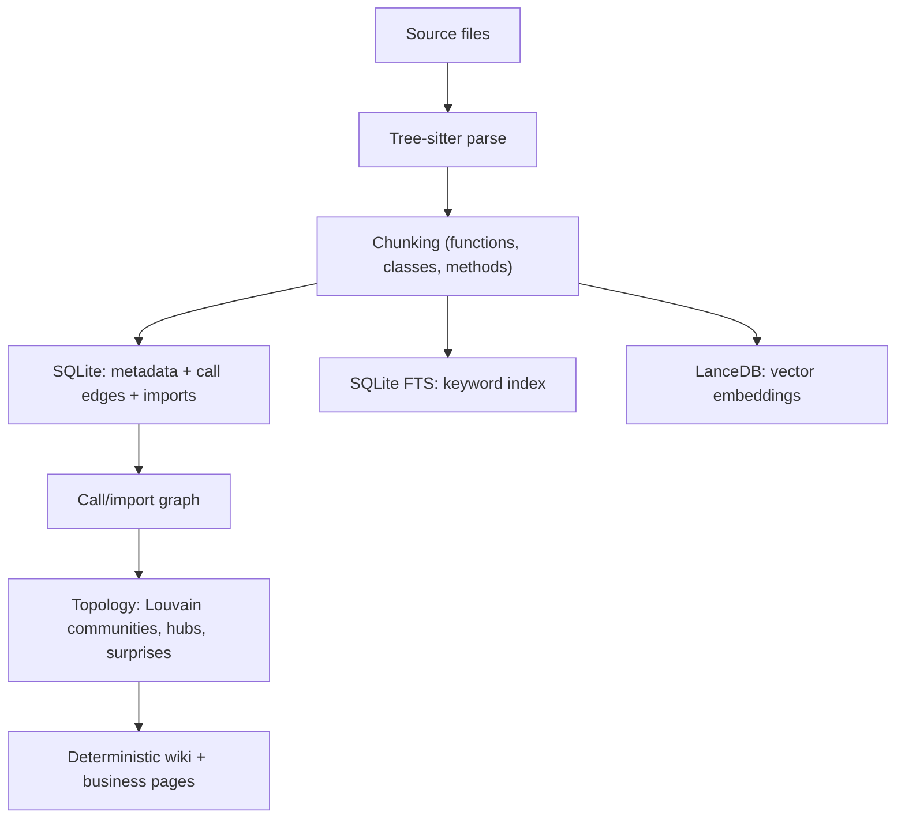

# Architecture

Reporecall indexes a project locally and exposes source-grounded context through CLI commands, Claude Code hooks, and MCP tools. It is a repo-intelligence engine — it deliberately does **not** absorb provider proxying, model hosting, or editor-UI responsibilities.

## Layers

| Layer | Role |
| --- | --- |
| **Indexer** | Scans files, chunks source with Tree-sitter, records imports and call edges. |
| **Storage** | Persists chunks, full-text search, metadata, graph edges, wiki, memory, and lens data in local stores. |
| **Search** | Routes prompts by intent, retrieves candidate chunks, expands graph evidence, assembles prompt context. |
| **Hooks** | Injects selected context into agent prompts and records hook diagnostics. |
| **MCP/CLI** | Exposes search, flow explanation, memory, business context, lens export, and indexing operations. |
| **Lens/Wiki** | Generates deterministic project views over code topology and business-facing capability evidence. |

## The pipeline

### 1. Parsing (Tree-sitter)

Source files are parsed with Tree-sitter (via `web-tree-sitter` + `tree-sitter-wasms`). This yields a syntax tree from which Reporecall extracts named, structural units rather than arbitrary text windows.

### 2. Chunking

The parser walks each tree for extractable units — functions, classes, methods — and produces chunks with names, kinds, parent names, line ranges, docstrings, and language. During the same pass it records **call edges** (who calls what) and **import statements** (what a file pulls in).

### 3. Indexing / storage

Chunks fan out into three local stores under `.memory/`:

- **`metadata.db`** (SQLite via `better-sqlite3`) — chunk metadata, call edges, imports, targets/aliases, stats, and detected conventions.
- **`fts.db`** (SQLite FTS) — the keyword/full-text index.
- **`lance/`** (LanceDB) — vector embeddings (absent in `keyword` mode).

The memory layer keeps a separate `memory-index/memories.db`. Bulk file deletions are wrapped in a single transaction for safety on large change sets.

### 4. Hybrid search + RRF ranking

A query is sanitized and classified into an intent mode, then:

1. **Keyword retrieval** from FTS and **semantic retrieval** from vectors run in parallel.
2. Results are fused with **Reciprocal Rank Fusion (RRF)** (constant `rrfK`, default 60) and weighted by `searchWeights` (`vector`/`keyword`/`recency`).
3. Candidates are **expanded along the graph** (callers, callees, import neighbors, siblings) with configurable discount factors.
4. Optional cross-encoder **reranking** can refine the top-K.

The guiding rule is **file coverage over chunk volume**: for trace and architecture prompts, Reporecall tries to cover the implementation path across layers — entry/UI, state/service, controller/edge function, and shared helpers — when those layers exist.

### 5. Call/import graph + community/topology

From the recorded edges Reporecall builds a graph (via `graphology`) and runs topology analysis after indexing:

- **Louvain community detection** groups tightly-connected symbols into modules.
- **Hub detection** surfaces high-degree nodes.
- **Surprise scoring** flags cross-module edges that connect otherwise-distant communities.

Topology is guarded for large repos: construction is skipped above `topologyMaxChunks` (default 50,000) so indexing stays bounded.

### 6. Generated wiki + business context

The topology and index feed **deterministic** generators:

- **Wiki pages** for communities, hubs, cross-module surprises, and captured flows/explorations.
- **Business capability pages** and **product areas** — an additive, product-language view (`businessPages[]`, `productAreas[]`) that keeps technical symbols as supporting evidence rather than the primary label.

Because generation is deterministic, external tools can consume the [Lens](./lens.md) JSON export without depending on Reporecall internals.

## Context assembly & compression

The retrieval-and-context pipeline builds context in a fixed order:

1. Sanitize and classify the prompt (`lookup`, `trace`, `bug`, `architecture`, `change`, `skip`).
2. Resolve explicit seeds when the prompt names a file, route, symbol, or subsystem.
3. Retrieve candidates via keyword/vector indexes and graph expansion.
4. Apply route-specific selection (bug localization, trace flow, or broad architecture inventory).
5. Assemble context under the configured token budget.
6. Add wiki, memory, and product-area evidence when relevant and within budget.
7. Return text plus diagnostics through hooks, CLI, or MCP.

When compression is enabled, primary evidence stays intact while secondary evidence is compacted into language-aware bullets that preserve imports, signatures, decorators, route/config/error literals, query matches, line numbers, and a `chunkId`. Any compacted entry can be re-expanded to full source through `search_code action=read_chunk`.

MCP clients should prefer `search_context` for multi-file questions — it returns the same assembled, compression-aware context used by hooks and CLI `explain`. Use `search_code` when you explicitly want raw matching chunks instead of a budgeted bundle.

## Freshness & staleness

v0.8.0 makes freshness explicit. Completed index/refresh passes stamp an `indexedCommit`; legacy indexes without a commit stamp are treated as **stale** in git repos rather than silently trusted. MCP responses and hook-injected context carry staleness banners with repair guidance, and stale daemon indexes can auto-refresh (debounced). Inspect freshness any time with `get_stats` or `reporecall stats`.

## Reference docs

This page summarizes two in-repo design docs shipped with the package:

- `docs/architecture-overview.md` — the layer table and scope boundaries.
- `docs/retrieval-context-pipeline.md` — the ordered pipeline and evidence-compression contract.
