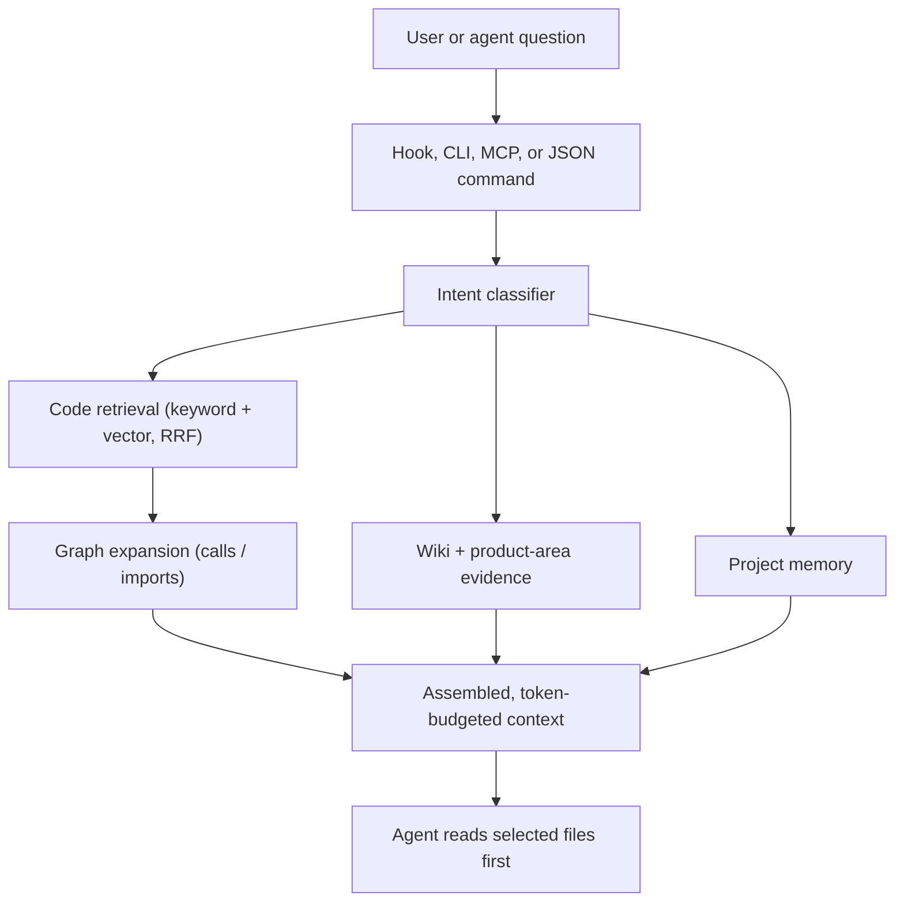

# Reporecall

**Reporecall** is a local, offline-first codebase memory and retrieval layer for coding agents. It indexes a repository on your machine, classifies each codebase question by intent, and returns focused source context to Claude Code, Codex, and any MCP-compatible client through hooks, MCP tools, and CLI commands.

It is a **context layer** — not an AI editor, a hosted model, or a PR-review SaaS. Its single job is to improve the context that your coding agent receives.

```text
 ____                                    _ _
|  _ \ ___ _ __   ___  _ __ ___  ___ __ _| | |
| |_) / _ \ '_ \ / _ \| '__/ _ \/ __/ _` | | |
|  _ <  __/ |_) | (_) | | |  __/ (_| (_| | | |
|_| \_\___| .__/ \___/|_|  \___|\___\__,_|_|_|
          |_|
```

## The problem it solves

Coding agents work best when the right files are already in context. Left on their own they burn tokens grepping, re-reading files, and guessing at architecture — and they still miss cross-module relationships that only a call/import graph can reveal.

Reporecall front-loads that work. It maintains a fresh index of your code, understands what a prompt is really asking (an exact lookup vs. a trace vs. an architecture inventory), and assembles a token-budgeted bundle of the files and symbols that actually matter — including graph neighbors the agent would not have found by keyword search alone.

## Key features

- **Intent-routed retrieval.** Every prompt is classified into one of six modes — `lookup`, `trace`, `bug`, `architecture`, `change`, or `skip` — and retrieval strategy adapts to the mode. Trace and architecture questions favor *file coverage across layers* (entry point, service, controller/handler, shared helpers) over raw chunk volume.
- **Hybrid search.** Keyword (SQLite FTS) and semantic (vector) retrieval are fused with Reciprocal Rank Fusion (RRF), then expanded along the call/import graph.
- **Call & import graph with topology analysis.** Reporecall records call edges and imports, then runs Louvain community detection, hub detection, and cross-module "surprise" scoring.
- **Generated wiki.** Deterministic wiki pages are produced for communities, hubs, cross-module surprises, captured flows, and business capabilities.
- **Persistent project memory.** Rules, facts, episodes, and working state survive across sessions and are injected alongside code context when relevant.
- **Business-context export.** An additive, product-language view (`productAreas[]`, `businessPages[]`) for planning tools and dashboards, kept separate from core code retrieval.
- **Architecture lens.** A portable single-file HTML dashboard plus a structured JSON export (`lens --json`) that external tools can consume without depending on Reporecall internals.
- **Six-tool MCP surface.** A compact, action-based MCP toolset (see [MCP Tools](./mcp-tools.md)).

## How it works (high level)



1. **Index.** Tree-sitter parses source into chunks; imports and call edges are recorded; metadata goes to SQLite, vectors to LanceDB.
2. **Classify.** The prompt is sanitized and routed to an intent mode.
3. **Retrieve.** Hybrid search finds candidate chunks; the graph adds callers, callees, and import neighbors.
4. **Assemble.** Context is packed under a token budget, with secondary evidence compressed (and reversible via `search_code action=read_chunk`).
5. **Deliver.** The bundle is returned through Claude Code hooks, MCP tools, or CLI `explain`/`search`.

See [Architecture](./architecture.md) for the full pipeline.

## Why local-first

Reporecall runs entirely on your machine. The default retrieval backend uses local SQLite/FTS indexes and local vector embeddings (`Xenova/all-MiniLM-L6-v2`); **no cloud embeddings API is required**. That means:

- **Privacy.** Your source never leaves the machine unless you explicitly choose the `openai` embedding provider.
- **No network dependency.** Indexing and retrieval work offline.
- **Deterministic outputs.** Wiki pages and the lens JSON are generated deterministically from the index, so external tools can rely on them.

Optional semantic backends (`ollama`, `openai`) can be configured separately if you want them — but the out-of-the-box experience needs no external services.

## Where to go next

- [Installation & Quick Start](./installation.md) — install globally or run via `npx`, then `init` → `index` → `search`.
- [CLI Reference](./cli-reference.md) — every command and flag.
- [MCP Tools](./mcp-tools.md) — the six tools coding agents call.
- [Configuration](./configuration.md) — `.memory/config.json`, providers, and the `OPENAI_API_KEY` security note.
- [Architecture](./architecture.md), [Memory](./memory.md), [Lens](./lens.md).
